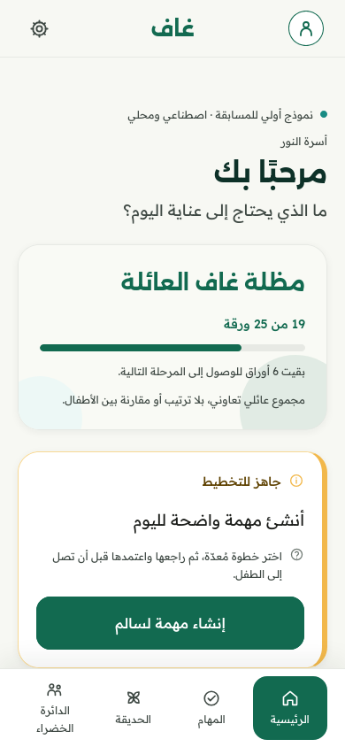
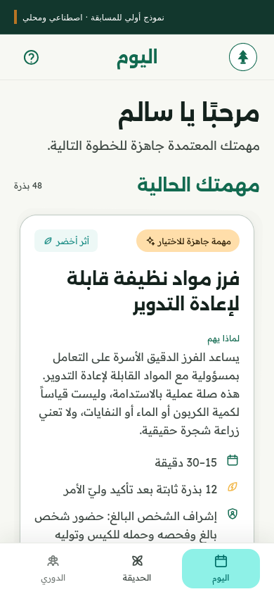
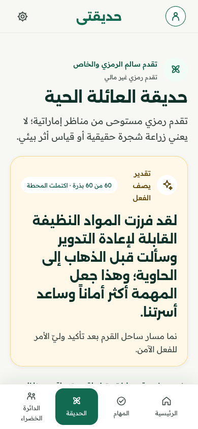

<p align="center">
  <picture>
    <source media="(prefers-color-scheme: dark)" srcset="assets/brand/ghaf/ghaf-mark-reverse.svg" />
    
  </picture>
</p>

<h1 align="center">Ghaf — غاف</h1>

<p align="center">
  <strong>Arabic-first family routines that grow connection, confidence, and sustainable habits.</strong>
</p>

<p align="center">
  SMAC 2026 competition prototype · Expo · React Native · Android-first · Arabic RTL + English LTR
</p>

Ghaf helps a Parent turn an everyday routine into one clear, age-appropriate task. A Child can
choose the task, complete it with permitted help, and ask for bounded coaching. After the Parent
gives specific praise and confirms the action, eligible acquisition work earns the displayed
symbolic Seeds and grows that Child's UAE-inspired landscapes. A separate family canopy records
eligible cooperative progress.

> **Prototype boundary:** The repeatable competition journey uses synthetic profiles, local task
> state and prepared assistance. Optional AI and family-messaging integrations have separate
> configuration and validation gates. This repository does not establish production readiness,
> payment processing or measured environmental impact.

## Latest updates — September 2026

- **New Ghaf identity:** the selected [5A Refined Classic logo](docs/design/brand/5a-refined-classic/README.md)
  brings three family figures beneath one canopy, with matching app icons and botanical UI.
- **Complete task catalog:** 24 curated tasks across eight categories now have Parent review,
  approved occurrences, Child completion and recognition flows. Recognition-only tasks earn no
  Seeds; eligible catalog tasks retain their fixed 4, 6 or 8 Seed awards. The separate recycling
  demonstration retains its 12 Seed award.
- **Personal growth:** each Child has their own task history and landscapes, alongside the shared
  family canopy. Switching Children or tasks preserves the correct approval and progress context.
- **Clearer entry and onboarding:** six botanical introduction pages lead to separate Parent and
  Child experiences. Arabic onboarding uses the six supplied v2 recordings with a text-only fallback.
- **Bounded communication foundation:** an isolated family-messaging client, server permission
  rules and task-focused helper presentation are implemented. Live service and two-device
  acceptance remain separate from the local task demonstration.

The [catalog execution contract](specs/013-parent-task-workspace/contracts/catalog-execution.md),
[narration record](docs/competition-readiness/workstreams/c-v2-narration.md) and
[messaging specification](specs/016-real-family-messaging/spec.md) document the exact boundaries.

## Product screens

<table>
  <tr>
    <td align="center" width="33%">
      
    </td>
    <td align="center" width="33%">
      
    </td>
    <td align="center" width="33%">
      
    </td>
  </tr>
  <tr>
    <td align="center"><strong>Parent Home</strong><br />Prepare and review the next task.</td>
    <td align="center"><strong>Child Today</strong><br />Choose, understand, and complete it with help.</td>
    <td align="center"><strong>Family Garden</strong><br />Recognize confirmed progress without loss or pressure.</td>
  </tr>
</table>

<p align="center"><sub>Earlier Arabic RTL captures from the local synthetic competition build; preserved as dated presentation evidence.</sub></p>

## The Ghaf experience

```text
Parent prepares and approves a task
  → Child chooses, completes, or asks for help
  → Parent gives specific praise, then confirms the observable action
  → eligible acquisition work awards the displayed Seeds exactly once
  → permanent personal landscapes and eligible family-canopy growth
```

| Experience            | What it provides                                                                                   |
| --------------------- | -------------------------------------------------------------------------------------------------- |
| Parent journey        | Family setup, task creation and approval, confirmation, praise, progress, and private reward plans |
| Child journey         | A separate, age-appropriate Today view with choice, retry, permitted help, and bounded coaching    |
| Sustainable growth    | 24 curated tasks, eight categories, fixed awards and five personal UAE-inspired landscape tracks   |
| Family connection     | Private family planning, cooperative canopy growth, and an invite-only synthetic League            |
| Safe assistance       | Constrained Parent Guide and Child Coach intents with deterministic fallback and safety validation |
| Accessible foundation | Arabic-first RTL, equivalent English LTR, reduced-motion support, captions, and scalable layouts   |

Ghaf's proposed **Family Plus** model keeps the core experience ad-free and previews one
household subscription for families with three to six Children. The competition build does not
process purchases or activate extra profiles; the
[commercial case](docs/GHAF_PLUS_COMMERCIAL_CASE.md) documents the pricing assumptions, which
never change a Child's safety, help, rewards, or access.

## Why it is different

- **Family agency first:** the Parent approves tasks and recognition; the Child may choose, ask for
  help, retry, or use an agreed smaller equivalent.
- **Growth without punishment:** earned Seeds and garden progress are permanent. There is no debt,
  loss, dying tree, randomized reward, or speed-based ranking.
- **AI within clear boundaries:** assistance stays tied to the approved task and cannot diagnose,
  infer personality or emotion, request secrets, or replace a trusted adult.
- **Privacy by design:** Parent and Child routes are separate, family rewards stay private, and
  shared views receive only explicitly eligible coarse events. Live-service security requires
  separate validation.
- **Built for its context:** Arabic is the starting language, Android is the authoritative demo
  platform, and the symbolic garden uses recognizable UAE landscapes.

## Quick start

### Requirements

- Node.js 22.13.0 (the version pinned in `.nvmrc` and CI), or a compatible newer version
- npm
- Git

Install the locked dependencies and start the offline web preview:

```bash
npm ci
npm run web -- --offline
```

Open the URL printed by Expo, normally `http://localhost:8081`. The app starts in Arabic RTL; use
the language control to switch to English.

For an Android Studio emulator or a physical USB device, follow the host-specific SDK, ADB, WSL2,
and native build instructions in the [development guide](docs/DEVELOPMENT.md). Android device
testing is authoritative; the web preview does not validate native Back, keyboard, permissions,
TalkBack, safe areas, or device performance.

### Fast synthetic demo entry

For the competition preview, start a separate demo-mode process:

```bash
EXPO_NO_DOTENV=1 EXPO_PUBLIC_GHAF_DEMO_ENTRY=true npm start
```

Fresh entry shows the original six-page onboarding, followed by the **Parent** and **Child**
choices. Parent opens the synthetic Parent experience; Child lets the operator choose **Salem**
or **Alya** without credentials. Each choice uses the existing role controller. Sign out and choose
another profile to continue the same task within the running app. Restarting starts a fresh demo;
independent phones do not synchronize. Demo repositories use isolated memory and do not replace
an ordinary locally configured family. Without this flag, the local Parent account chooser and
Child pairing paths remain in use. Local Parent account selection requires no verification code;
it is prototype access, separate from real messaging authentication.

Arabic onboarding selects the supplied v2 narration. Use the speaker control when a browser
requires an explicit playback gesture. English demo narration remains silent; the ordinary
English onboarding retains its prepared v1 clips. Unavailable audio never blocks navigation.
Pronunciation, transcript parity and physical-device listening still require human review.
For the standalone internal Android build, use the pinned local toolchain and exact-source
receipt procedure in the [Android guide](docs/competition-readiness/android-build-and-rehearsal.md).
A web preview is not an installable APK or evidence of physical-phone acceptance.

## Verification

Run the complete repeatable repository gate:

```bash
npm run verify
```

| Command                | Purpose                                                        |
| ---------------------- | -------------------------------------------------------------- |
| `npm test`             | Run deterministic domain, service, state, and flow tests       |
| `npm run repo:check`   | Validate navigation, test locations and tracked-artifact rules |
| `npm run typecheck`    | Check strict TypeScript                                        |
| `npm run lint`         | Run Expo ESLint                                                |
| `npm run format:check` | Check maintained source and documentation formatting           |
| `npm run build:web`    | Produce the ignored static web export in `dist/`               |

Automated checks do not replace physical Android, accessibility, media, or human-review evidence.
The current auditable product gate status is recorded in the [demo runbook](docs/competition-readiness/DEMO_RUNBOOK.md).
The [GitHub workflow](.github/workflows/ci.yml) defines the same source checks and a web export;
its hosted execution is pending. See the [test guide](tests/README.md) for focused commands.

## Architecture

Ghaf uses one Expo/React Native application with TypeScript, Expo Router, Tamagui, Zustand, Zod,
and Arabic/English resources. Alexandria and Readex Pro provide the shared typography. Thin routes
call reusable components and provider-neutral services; domain rules own approval, awards and
privacy. Every required competition path has a resettable deterministic provider.

```text
app/ routes
  → src/components/ + src/design/ + src/i18n/
  → src/state/usePrototypeStore.ts
  → src/features/ domain and assistant policy
  → src/services/interfaces/ provider-neutral contracts
  → src/services/mock/ deterministic providers and fixtures
```

| Path              | Responsibility                                                        |
| ----------------- | --------------------------------------------------------------------- |
| `app/`            | Expo Router screens and navigation                                    |
| `src/components/` | Shared UI and Family Growth presentation                              |
| `src/features/`   | Task, reward, garden, privacy, and assistant rules                    |
| `src/services/`   | Contracts, provider registry, and deterministic local implementations |
| `src/state/`      | Application commands and exact prototype reset                        |
| `src/i18n/`       | Arabic/English resources and direction utilities                      |
| `workers/`        | Bounded AI/MCP gateway and separate family-messaging backend          |
| `tests/`          | Domain, safety, privacy, reset, and complete-flow verification        |

### AI and database integrations

The team describes Ghaf's project architecture as an **Expo/React Native app → backend API →
Gemini AI**, with an **MCP server** for approved tools and **Firebase** as the database. The
[latest poster handoff](docs/competition-readiness/workstreams/ghiraas-inspired-poster.md)
uses that architecture.

Repository evidence has a narrower scope: the [AI/MCP gateway](workers/ghaf-ai-gateway/README.md)
is a default-off reference implementation, and the default assistant registry uses prepared
responses. Gemini/Firebase deployment and end-to-end operation are not verified by the local
demo or its screenshots. The separately specified [family-messaging service](workers/ghaf-family-messaging/README.md)
uses Supabase Auth and PostgreSQL; it does not synchronize task, Seed or landscape state.

Local family settings use SQLite-backed key/value storage on native and browser storage on web.
Competition task progress remains process-local: restarting is not durable recovery.

See the [architecture guide](docs/architecture/ARCHITECTURE.md) for dependency direction, data
ownership, and failure behavior, and the [repository map](docs/architecture/REPOSITORY_STRUCTURE.md)
for the complete folder structure and placement rules.

## Documentation

The [root-file guide](docs/architecture/PUBLIC_REPOSITORY.md) explains the cleaned root and
relocated documents. [AI assistance and team review](docs/AI_ASSISTANCE.md) records the disclosure
boundary and links to the detailed contribution history.

- [Documentation index](docs/README.md) — engineering, product, and evidence map
- [Product contract](docs/PRODUCT.md) — users, lifecycle rules, commercial preview, and P0 scope
- [Design contract](docs/DESIGN.md) and [design direction](docs/design/DESIGN_DIRECTION.md) — visual and interaction
  rules
- [Research basis](docs/product/RESEARCH_BASIS.md) — reward, safety, content, and UAE-grounding rationale
- [Development guide](docs/DEVELOPMENT.md) — setup, USB device workflow, reset, and troubleshooting
- [Prototype limitations](docs/product/PROTOTYPE_LIMITATIONS.md) — explicit capability and evidence boundaries
- [Demo runbook](docs/competition-readiness/DEMO_RUNBOOK.md) — judge journey, expected values, and validation status
- [Poster handoff](docs/competition-readiness/workstreams/ghiraas-inspired-poster.md) — latest editable poster and architecture revision
- [Contributing](CONTRIBUTING.md) — ownership, implementation, validation, and handoff workflow

## Safety and truthfulness

- Parent approval is required before assignment and before Seeds or symbolic growth.
- Seeds are fixed, nonfinancial, permanent, and never deducted.
- No Child age band receives unrestricted chat, live background listening, or hidden analysis.
- Prepared assistants disclose that they may be wrong and direct hazards to a trusted adult.
- Symbolic garden growth does not claim that a real tree was planted or that environmental impact
  was measured.
- Real payments, public ranking, analytics and notifications are outside the competition build.
- Optional server AI and real family messaging remain subject to their own activation and evidence
  gates; their presence in source does not establish deployment or production child-data protection.

Never place provider secrets in `EXPO_PUBLIC_*` variables or the mobile bundle. The complete
competition path remains deterministic and available offline.
