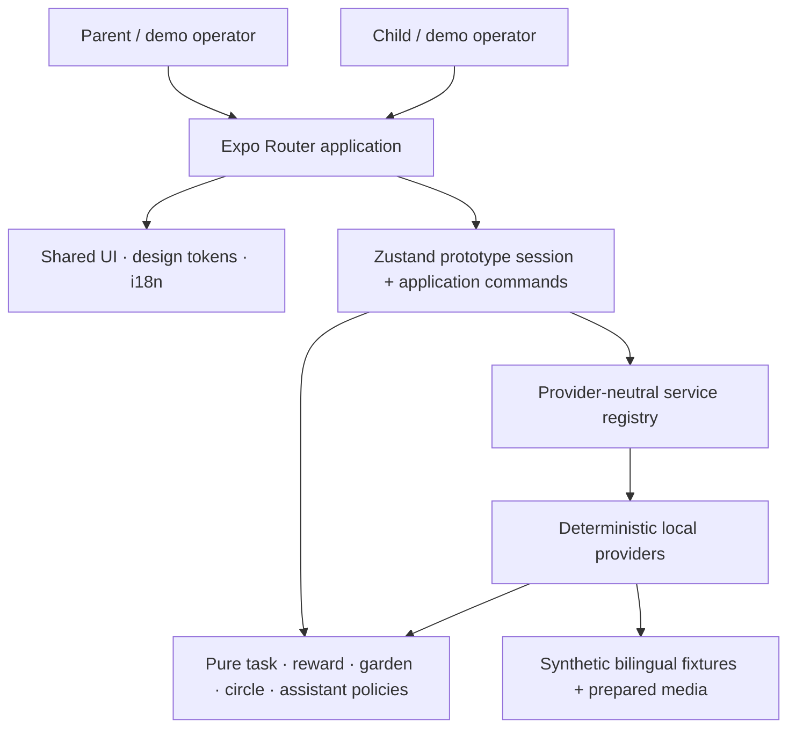

# Ghaf architecture

## Purpose and boundary

Ghaf P0 is one Expo/React Native application that demonstrates a deterministic Parent → Child →
confirmation → living-garden journey. It owns an in-memory synthetic household session and works
with external services denied. It does not contain a production backend, authentication system,
cross-household network, analytics pipeline, or live child-media/AI processor.

The active implementation plan remains authoritative for Feature 003 detail:
[`specs/003-family-growth-garden/plan.md`](../../specs/003-family-growth-garden/plan.md).

## System context

The matching Mermaid source is [system-context.mmd](system-context.mmd).



## Runtime containers

| Container           | Location                                      | Responsibility                                                                                     | Must not own                                                                                      |
| ------------------- | --------------------------------------------- | -------------------------------------------------------------------------------------------------- | ------------------------------------------------------------------------------------------------- |
| Routes              | `app/`                                        | Route composition, role guards, navigation, and route-local presentation state                     | Reward arithmetic, privacy projection, concrete remote providers, or independent counter mutation |
| Presentation        | `src/components/`, `src/design/`, `src/i18n/` | Reusable bilingual UI, logical RTL/LTR behavior, tokens, accessibility, and prepared-origin labels | Domain lifecycle or recognition authority                                                         |
| Application session | `src/state/usePrototypeStore.ts`              | One schema-versioned session and intentional commands that orchestrate policies/services           | Current route, provider secrets, or production persistence claims                                 |
| Domain policy       | `src/features/`                               | Pure validation, lifecycle, recognition, growth, projection, and assistant safety rules            | UI or network transport                                                                           |
| Contracts           | `src/models/`, `src/services/interfaces/`     | Typed domain/session values and provider-neutral service interfaces                                | Concrete fixture selection                                                                        |
| Local providers     | `src/services/mock/`                          | Required deterministic providers, reset factories, synthetic fixtures, and prepared fallback       | Unbounded chat, real Child data, or remote secrets                                                |
| Prepared assets     | `assets/images/`, `assets/audio/`             | Reviewed synthetic fixture plus provenance/transcript sidecars                                     | Capture, ambient recording, or real media                                                         |

## Dependency direction

The intended source dependency direction is:

```text
routes → presentation + application commands
application commands → models + pure policies + service interfaces
service registry → interfaces + deterministic providers
deterministic providers → models + pure policies + local fixtures
```

Policies do not depend on React Native. Screens import the central service registry rather than
constructing providers. Shared interface copy belongs in `src/i18n/resources.ts`; bilingual domain
fixtures remain typed fixture data. `src/design/tokens.ts` is the single visual-token entry point.

## Data ownership and privacy

| Data                                                      | Owner                                   | Sharing rule                                                                                                 |
| --------------------------------------------------------- | --------------------------------------- | ------------------------------------------------------------------------------------------------------------ |
| Synthetic household, Children, active journey, and ledger | Prototype session                       | Local to the running demo                                                                                    |
| Task lifecycle and recognition eligibility                | Task/reward policies                    | Parent-gated; no direct route mutation                                                                       |
| Seeds and landscape state                                 | Recognition transaction + garden policy | Symbolic, permanent, and local                                                                               |
| Combined canopy                                           | Household projection                    | Only after privacy filtering                                                                                 |
| Circle progress                                           | Circle projection                       | Coarse eligible household Green Impact action only; no Child, task, Seed, note, reflection, or media details |
| Assistant requests/results                                | Assistant policy and prepared providers | Bounded to an approved task or neutral synthetic summary; no unrestricted Child chat                         |
| Prepared media                                            | Media service + local assets            | Synthetic, optional, labeled, and never treated as live analysis                                             |

`visibilityScope` and `circleEligible` are evaluated before shared counters or visuals change.
Circle eligibility is rejected unless the task is household-visible Green Impact work.

## Critical recognition transaction

```text
submitted task
  → Parent plans confirmation (no counters change)
  → Parent presents final action-specific praise (no counters change)
  → separate visible continuation requests recognition
  → validate complete task/Child/version/submission/check-in links
  → return immutable prior receipt when the idempotency key already exists
  → validate reward/phase/recurrence
  → filter household and circle projections
  → atomically commit Seeds, landscape, canopy, circle, receipt, and celebration
```

A failure before the atomic commit changes no counter. Retry never deducts an earned value. A late
optional Parent Guide result is ignored after the bounded timeout, and the same deterministic
fallback remains available.

## Reset and recovery

`resetPrototype()` replaces the complete session with the canonical schema-versioned fixture. The
navigation adapter separately replaces browser/native history and returns to `/` in Arabic RTL.
This separation keeps domain reset testable without storing navigation state.

The deterministic path is the recovery path for unavailable, timed-out, or invalid optional
providers. Prepared image/audio surfaces retain descriptions/transcripts when media is unavailable.

## Non-functional assumptions

- Scale is intentionally one synthetic household, two siblings, one seeded circle aggregate, eight
  categories, five landscape tracks, and one executable Green Impact task.
- State is in memory; reload persistence is not promised.
- Android is authoritative. Web static rendering is a secondary development/evidence proxy.
- The complete path must work offline after dependencies and the app build are available.
- Motion explains cause and effect but never controls whether state commits.
- The P0 provider set is local. Any future live model requires a separately approved server-side
  boundary, structured schema, age policy, timeout, fallback, and secret isolation.

## Repository organization rules

- Keep routes small; extract reusable presentation to `src/components/` and behavior to
  `src/features/`.
- Add a feature directory only when it owns behavior, not as an empty placeholder.
- Keep generated caches, static exports, and raw browser sessions ignored.
- Preserve root Feature 003 contracts and historical Feature 001/002 specifications/evidence in
  place; use [the documentation map](../README.md) to disambiguate them.
- Introduce no second app, overlapping state/UI/localization library, or production infrastructure
  without an approved architecture/specification change.

## Current pressure points

The architecture is appropriate for the competition scale, but several files are larger than the
preferred team-editing boundary: the session store, deterministic provider module,
`GardenLandscape`, `TaskPanels`, and some routes. A later behavior-preserving refactor should split
internal command/provider/presentation sections behind their current public contracts. It should
not create multiple stores, duplicate domain models, or change the deterministic journey merely to
reduce line counts.

Some presentation code still consumes selected prepared fixtures directly. Future extraction
should expose those values through provider-neutral selectors/contracts before a live adapter is
considered. This is maintainability debt, not permission to add a backend to P0.

## Decisions and deeper contracts

- [ADR 0001 — Single Expo app with deterministic local core](adr/0001-single-expo-deterministic-core.md)
- [Feature 003 domain contract](../../specs/003-family-growth-garden/contracts/domain-contract.md)
- [Feature 003 assistant contract](../../specs/003-family-growth-garden/contracts/assistant-contract.md)
- [Feature 003 acceptance contract](../../specs/003-family-growth-garden/contracts/acceptance-contract.md)
