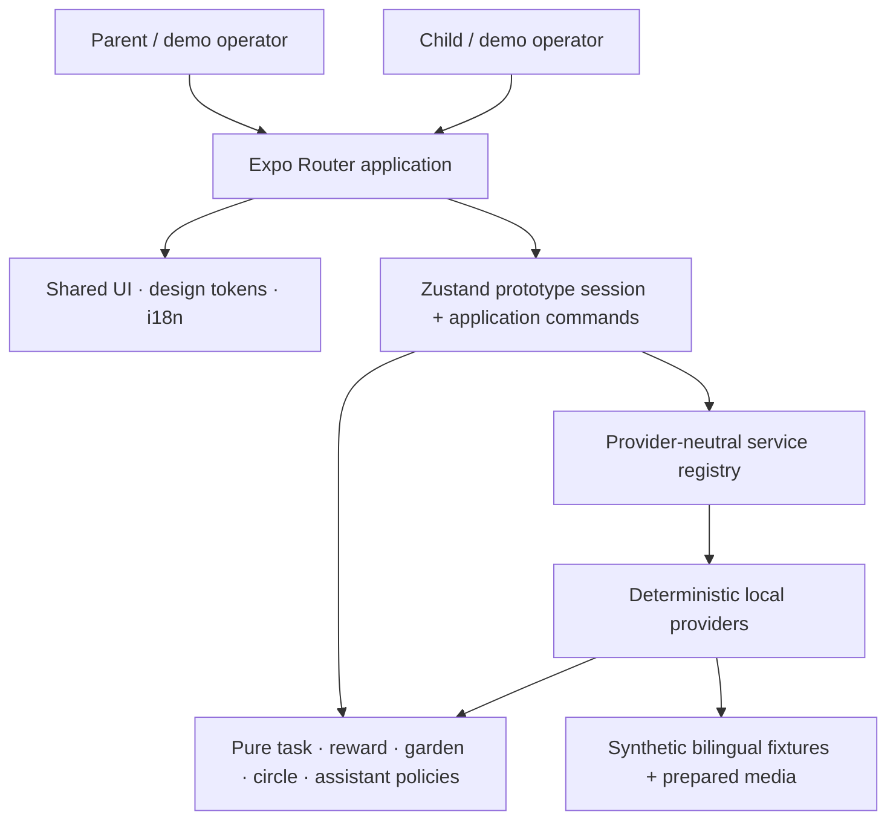
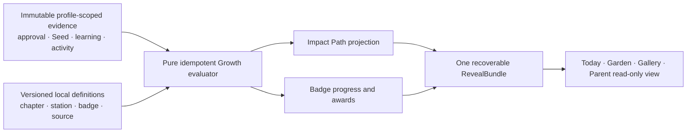

# Ghaf Architecture

**Status date:** 2026-09-03
**Current runtime:** R001 Batch 1 only, layered on the preserved Revision 1 deterministic baseline
**Proposed extension:** Feature 003 Revision 3 Growth Journey; design and runtime **BLOCKED**

## Purpose and boundary

Ghaf P0 remains one Expo/React Native application. The current released slice implements the R001
Welcome and first-time Parent onboarding on top of a preserved Revision 1 deterministic
Parent → Child → confirmation → living-garden baseline. The later Revision 2 experience and every
Revision 3 Growth Journey route, model, evaluator, asset, test, and persistence change remain
unimplemented until their complete Google Stitch release is supplied, reconciled, and approved.

The current application owns an in-memory synthetic household session and works with external
services denied. It does not contain a production backend, production authentication, a real
cross-household network, analytics pipeline, durable product store, or live Child-media/AI
processor.

The active implementation plan remains authoritative for Feature 003 detail:
[`specs/003-family-growth-garden/plan.md`](../../specs/003-family-growth-garden/plan.md).

## Current Runtime Context

The matching Mermaid source is [system-context.mmd](system-context.mmd).



## Current Runtime Containers

This table describes existing source boundaries. It does not imply that unreleased Revision 2 or
Revision 3 screens and behaviors exist.

| Container           | Location                                      | Responsibility                                                                                     | Must not own                                                                                      |
| ------------------- | --------------------------------------------- | -------------------------------------------------------------------------------------------------- | ------------------------------------------------------------------------------------------------- |
| Routes              | `app/`                                        | Route composition, role guards, navigation, and route-local presentation state                     | Reward arithmetic, privacy projection, concrete remote providers, or independent counter mutation |
| Presentation        | `src/components/`, `src/design/`, `src/i18n/` | Reusable bilingual UI, logical RTL/LTR behavior, tokens, accessibility, and prepared-origin labels | Domain lifecycle or recognition authority                                                         |
| Application session | `src/state/usePrototypeStore.ts`              | One schema-versioned session and intentional commands that orchestrate policies/services           | Current route, provider secrets, or production persistence claims                                 |
| Domain policy       | `src/features/`                               | Pure validation, lifecycle, recognition, growth, projection, and assistant safety rules            | UI or network transport                                                                           |
| Contracts           | `src/models/`, `src/services/interfaces/`     | Typed domain/session values and provider-neutral service interfaces                                | Concrete fixture selection                                                                        |
| Local providers     | `src/services/mock/`                          | Required deterministic providers, reset factories, synthetic fixtures, and prepared fallback       | Unbounded chat, real Child data, or remote secrets                                                |
| Prepared assets     | `assets/images/`, `assets/audio/`             | Reviewed synthetic fixture plus provenance/transcript sidecars                                     | Capture, ambient recording, or real media                                                         |

## Dependency Direction

The intended source dependency direction is:

```text
routes → presentation + application commands
application commands → models + pure policies + service interfaces
service registry → interfaces + deterministic providers
deterministic providers → models + pure policies + local fixtures
```

Policies do not depend on React Native. Screens import the central service registry rather than
constructing providers. Shared interface copy belongs in `src/i18n/resources.ts`; bilingual domain
fixtures remain typed fixture data. `src/design/tokens.ts` is the single visual-token entry point.

## Current Data Ownership and Privacy

| Data                                                      | Owner                                   | Sharing rule                                                                                                 |
| --------------------------------------------------------- | --------------------------------------- | ------------------------------------------------------------------------------------------------------------ |
| Synthetic household, Children, active journey, and ledger | Prototype session                       | Local to the running demo                                                                                    |
| Task lifecycle and recognition eligibility                | Task/reward policies                    | Parent-gated; no direct route mutation                                                                       |
| Seeds and landscape state                                 | Recognition transaction + garden policy | Symbolic, permanent, and local                                                                               |
| Combined canopy                                           | Household projection                    | Only after privacy filtering                                                                                 |
| Circle progress                                           | Circle projection                       | Coarse eligible household Green Impact action only; no Child, task, Seed, note, reflection, or media details |
| Assistant requests/results                                | Assistant policy and prepared providers | Bounded to an approved task or neutral synthetic summary; no unrestricted Child chat                         |
| Prepared media                                            | Media service + local assets            | Synthetic, optional, labeled, and never treated as live analysis                                             |

`visibilityScope` and `circleEligible` are evaluated before shared counters or visuals change.
Circle eligibility is rejected unless the task is household-visible Green Impact work.

## Current/Historical Recognition Transaction

```text
submitted task
  → Parent plans confirmation (no counters change)
  → Parent presents final action-specific praise (no counters change)
  → separate visible continuation requests recognition
  → validate complete task/Child/version/submission/check-in links
  → return immutable prior receipt when the idempotency key already exists
  → validate reward/phase/recurrence
  → filter household and circle projections
  → atomically commit Seeds, landscape, canopy, circle, receipt, and celebration
```

A failure before the atomic commit changes no counter. Retry never deducts an earned value. A late
optional Parent Guide result is ignored after the bounded timeout, and the same deterministic
fallback remains available.

## Proposed Revision 3 Growth Journey Extension — Blocked

Revision 3 extends the deterministic core with a read-only Impact Path projection, permanent
private badges, finite sourced learning, and one result presentation. It does not add a currency,
network service, fourth Child tab, public profile, or second source of truth. This extension is a
proposed architecture contract only; it is not approved runtime evidence.



The screen layer receives evaluated projections and localized definitions. It must never calculate
a station, mastery credit, badge award, or reward consequence. The evaluator consumes only
committed evidence for the active Child profile and returns the same result when an event is
replayed. Learning and defined activity events are individually idempotent, award zero Seeds, and
change no landscape. Migration may backfill only states supported by provable history and queues no
RevealBundle.

### Proposed interfaces and ownership

| Contract                         | Proposed owner                                | Rule                                                                                                         |
| -------------------------------- | --------------------------------------------- | ------------------------------------------------------------------------------------------------------------ |
| Approval and Seed evidence       | Existing recognition transaction              | One immutable profile-scoped event/receipt per valid Parent approval                                         |
| Mastery evidence                 | Growth evaluator over task-version metadata   | Acquisition credit only; maintenance and recognition-only activity contribute zero                           |
| Learning/activity evidence       | Versioned local learning service              | Exact named criterion only; idempotent; zero Seeds and garden growth; equivalent route receives equal credit |
| Path chapter/station definitions | Deterministic local provider                  | Versioned thresholds and unlock arrays; P0 Water & Coast is 120–180                                          |
| Badge definitions/progress       | Deterministic local provider + pure evaluator | Exactly 16 configured definitions; explicit component progress; earned state never expires or downgrades     |
| RevealBundle                     | Application command/result projection         | At most one pending/seen bundle per triggering event; presentation does not own committed values             |
| Parent progress view             | Privacy-safe selected-Child selector          | Read-only; no comparison, recommendation, diagnosis, or Child mutation                                       |

### Separate progress authorities

Equal fixture numbers do not make these values interchangeable:

| Authority                       | Source and reset behavior                                                                                   | Growth Journey relationship                                              |
| ------------------------------- | ----------------------------------------------------------------------------------------------------------- | ------------------------------------------------------------------------ |
| Lifetime Seeds                  | Parent-approved immutable Seed receipts; permanent                                                          | Sole input to cumulative Impact Path thresholds; never spent             |
| Landscape growth                | Eligible task-to-landscape mapping and provenance; permanent                                                | May appear in the same result but is not derived from Path station state |
| League and canopy               | Privacy-filtered Challenge Leaf/cooperative events; weekly League state resets while canopy history remains | Separate projection; badges and Path never change rank                   |
| Family Reward eligible progress | Explicit fail-closed plan/task-version eligibility; private and permanent after unlock                      | May share a numeric fixture total but never reads Path or League state   |
| Learning/activity evidence      | Explicit profile-scoped idempotent completion events; retained by its own reset rule                        | May satisfy only a named criterion; adds zero Seeds or garden growth     |
| Presentation preferences        | Install/profile-safe opening version, replay origin, and authorized deferred destination                    | Never awards or resets domain progress                                   |

The canonical confirmation is committed once and presented as praise → optional qualified
self-reported activity result → Seeds → mapped garden → canopy/Challenge Leaf/League →
Path/badges/safe-help recognition → private Family Reward last. Presentation order does not merge
the ledgers or permit partial commits.

## Reset and Recovery

`resetPrototype()` replaces the complete session with the canonical schema-versioned fixture. The
navigation adapter separately replaces browser/native history and returns to `/` in Arabic RTL.
This separation keeps domain reset testable without storing navigation state.

The deterministic path is the recovery path for unavailable, timed-out, or invalid optional
providers. Prepared image/audio surfaces retain descriptions/transcripts when media is unavailable.

For the proposed Revision 3 flow, ordinary introduction replay, route replay, app resume, Garden
re-entry, and RevealBundle recovery must preserve every earned value. Only the explicit
Parent-authorized demo reset may replace the whole profile/session with the documented fixture,
clear pending transaction/reveal state, replace navigation history, and return signed out in Arabic
RTL. First-run/replay presentation preferences remain separate from domain evidence so replay can
never reset a task, Seed, station, badge, learning record, landscape, League/canopy history, or
Family Reward.

### Proposed local persistence gap

The current session is in memory and does not promise reload persistence. Revision 3 requires a
small profile-isolated, schema-versioned local persistence adapter before permanent Path/badge and
introduction-return behavior can be claimed. No adapter or dependency has been selected, approved,
or implemented. Its future gate must define atomic writes, migration from the current session
schema, evidence-backed badge backfill without a reveal, corrupt/unsupported-version fallback, and
the exact Parent-reset boundary. Until that decision is released, reload persistence remains a
known gap rather than an inferred capability.

## Non-Functional Assumptions

- Scale is intentionally one synthetic household, two siblings, one seeded circle aggregate, eight
  categories, five landscape tracks, and one executable Green Impact task.
- Current state is in memory; reload persistence is not promised. The Revision 3 adapter described
  above is proposed only.
- Android is authoritative. Web static rendering is a secondary development/evidence proxy.
- The complete path must work offline after dependencies and the app build are available.
- Motion explains cause and effect but never controls whether state commits.
- The P0 provider set is local. Any future live model requires a separately approved server-side
  boundary, structured schema, age policy, timeout, fallback, and secret isolation.

## Repository Organization Rules

- Keep routes small; extract reusable presentation to `src/components/` and behavior to
  `src/features/`.
- Add a feature directory only when it owns behavior, not as an empty placeholder.
- Keep generated caches, static exports, and raw browser sessions ignored.
- Preserve root Feature 003 contracts and historical Feature 001/002 specifications/evidence in
  place; use [the documentation map](../README.md) to disambiguate them.
- Introduce no second app, overlapping state/UI/localization library, or production infrastructure
  without an approved architecture/specification change.

## Current Pressure Points

The architecture is appropriate for the competition scale, but several files are larger than the
preferred team-editing boundary: the session store, deterministic provider module,
`GardenLandscape`, `TaskPanels`, and some routes. A later behavior-preserving refactor should split
internal command/provider/presentation sections behind their current public contracts. It should
not create multiple stores, duplicate domain models, or change the deterministic journey merely to
reduce line counts.

Some presentation code still consumes selected prepared fixtures directly. Future extraction
should expose those values through provider-neutral selectors/contracts before a live adapter is
considered. This is maintainability debt, not permission to add a backend to P0.

## Decisions and Deeper Contracts

- [ADR 0001 — Single Expo app with deterministic local core](adr/0001-single-expo-deterministic-core.md)
- [ADR 0002 — Impact Path as a projection over immutable evidence](adr/0002-impact-path-projection.md)
- [Feature 003 domain contract](../../specs/003-family-growth-garden/contracts/domain-contract.md)
- [Feature 003 assistant contract](../../specs/003-family-growth-garden/contracts/assistant-contract.md)
- [Feature 003 acceptance contract](../../specs/003-family-growth-garden/contracts/acceptance-contract.md)
