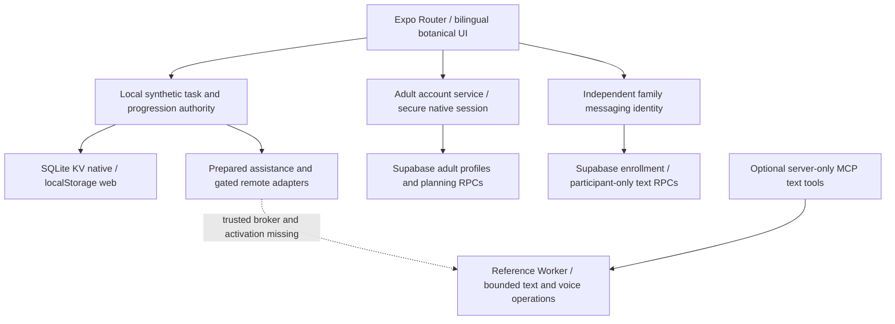

# Ghaf architecture

## Purpose and boundary

Ghaf is one Expo 57 / React Native 0.86 Android-first application with three separate
data authorities. The deterministic Parent → Child → confirmation → garden journey
uses process-local task/progression state. Ordinary local-family records, study,
saved wording, onboarding/audio preferences and Feature019 text memories use device
storage; quick demo and account samples use isolated memory. Real adult profiles
and private planning workspaces use one Supabase project. Enrolled family messaging
uses a separate Supabase project and server-authorized participants.

Real messaging and adult planning do not synchronize the executable Child task,
Seeds, landscapes, rewards or new memory timeline. None of these integrations
establishes production readiness. This description was reconciled during the
[R01–R38 audit](../competition-readiness/feature-implementation-audit.md); older
specification evidence remains attributed to its original source.

The [product contract](../PRODUCT.md), [design contract](../DESIGN.md), and
[prototype limitations](../product/PROTOTYPE_LIMITATIONS.md) define the public Feature 003 boundary.

## System context

The matching Mermaid source is [system-context.mmd](system-context.mmd).



## Runtime containers

| Container              | Location                                            | Responsibility                                                                                                                                        | Must not own                                                                                                          |
| ---------------------- | --------------------------------------------------- | ----------------------------------------------------------------------------------------------------------------------------------------------------- | --------------------------------------------------------------------------------------------------------------------- |
| Routes                 | `app/`                                              | Route composition, role guards, navigation, and route-local presentation state                                                                        | Reward arithmetic, privacy projection, concrete remote providers, or independent counter mutation                     |
| Presentation           | `src/components/`, `src/design/`, `src/i18n/`       | Reusable bilingual UI, logical RTL/LTR behavior, tokens, accessibility, and prepared-origin labels                                                    | Domain lifecycle or recognition authority                                                                             |
| Application session    | `src/state/usePrototypeStore.ts`                    | One schema-versioned session and intentional commands that orchestrate policies/services                                                              | Current route, provider secrets, or production persistence claims                                                     |
| Local family directory | `src/features/local-family/`, `src/services/local/` | Validate and persist one configured demo household, normalized Parent lookup identifier, and paired markers; restore access-facing profile projection | Verification codes, passwords, sessions, task/reward/Garden ledgers, media, cloud sync, or production security claims |
| Domain policy          | `src/features/`                                     | Pure validation, lifecycle, recognition, growth, projection, and assistant safety rules                                                               | UI or network transport                                                                                               |
| Contracts              | `src/models/`, `src/services/interfaces/`           | Typed domain/session values and provider-neutral service interfaces                                                                                   | Concrete fixture selection                                                                                            |
| Local providers        | `src/services/mock/`                                | Required deterministic providers, reset factories, synthetic fixtures, and prepared fallback                                                          | Unbounded chat, real Child data, or remote secrets                                                                    |
| Prepared assets        | `assets/images/`, `assets/audio/`                   | Reviewed synthetic fixture plus provenance/transcript sidecars                                                                                        | Capture, ambient recording, or real media                                                                             |

## Dependency direction

The intended source dependency direction is:

```text
routes → presentation + application commands
application commands → models + pure policies + service interfaces
service registry → interfaces + deterministic providers
deterministic providers → models + pure policies + local fixtures
```

Policies do not depend on React Native. Screens import the central service registry rather than
constructing providers. Shared interface copy belongs in `src/i18n/resources.ts`; bilingual domain
fixtures remain typed fixture data. `src/design/tokens.ts` is the single visual-token entry point.

## Data ownership and privacy

| Data                                                              | Owner                                   | Sharing rule                                                                                                 |
| ----------------------------------------------------------------- | --------------------------------------- | ------------------------------------------------------------------------------------------------------------ |
| Parent lookup identifier, configured profiles, and paired markers | Local family repository                 | Device-local, one household, normalized exact match before returning verification; Parent reset clears it    |
| Synthetic household, Children, active journey, and ledger         | Prototype session                       | Local to the running demo; only display profile fields project from the directory                            |
| Task lifecycle and recognition eligibility                        | Task/reward policies                    | Parent-gated; no direct route mutation                                                                       |
| Seeds and landscape state                                         | Recognition transaction + garden policy | Symbolic and no-loss in the running process; durable recovery is missing                                     |
| Combined canopy                                                   | Household projection                    | Only after privacy filtering                                                                                 |
| Circle progress                                                   | Circle projection                       | Coarse eligible household Green Impact action only; no Child, task, Seed, note, reflection, or media details |
| Assistant requests/results                                        | Assistant policy and prepared providers | Bounded to an approved task or neutral synthetic summary; no unrestricted Child chat                         |
| Prepared media                                                    | Media service + local assets            | Synthetic, optional, labeled, and never treated as live analysis                                             |

`visibilityScope` and `circleEligible` are evaluated before shared counters or visuals change.
Circle eligibility is rejected unless the task is household-visible Green Impact work.

Adult profile/workspace RPCs derive ownership from provider identity and deny
cross-account, banned, deleted and anonymous access. Messaging derives household,
role and Child membership from provisioned server records plus current provider
session and device state; client family IDs/selected roles are not permission.
Peer permission management gives Parents no access to peer conversation content.
Human messages, locations and transcripts never enter the AI context automatically.

Feature019 memories are private synthetic text records bound to the existing opaque
local family instance. Parent save requires an eligible recognized household Green
Impact task; Child reads are profile-scoped. Tombstones prevent deleted completion
memories reappearing. Memories confer no reward authority and cannot restore Seeds.

The user's Gemini/MCP/Firebase diagram is recorded in the poster workstream, but
the original PowerPoint was not located in this checkout. Firebase runtime code is
absent. Existing gateway operations use Workers AI; an opt-in Gemini text adapter
is implemented under Feature019 with local transport/validation tests. MCP projects two bounded operations server-side;
the mobile app does not need MCP for every request. Broker/shared replay/budget
configuration and actual external-model verification remain separate blockers.

## Critical recognition transaction

```text
submitted task
  → Parent plans confirmation (no counters change)
  → Parent presents final action-specific praise (no counters change)
  → separate visible continuation requests recognition
  → validate complete task/Child/version/submission/check-in links
  → return immutable prior receipt when the idempotency key already exists
  → validate reward/phase/recurrence
  → filter household and circle projections
  → atomically commit Seeds, landscape, canopy, circle, receipt, and celebration
```

A failure before the atomic commit changes no counter. Retry never deducts an earned value. A late
optional Parent Guide result is ignored after the bounded timeout, and the same deterministic
fallback remains available.

## Reset and recovery

`resetPrototype()` validates Parent authority, clears the local repositories and
replaces the session with canonical fixtures. The existing multi-key cleanup is
sequential, not a failure-atomic database transaction; later-key failure remains a
recorded recovery risk. Feature019 protects new memory records on failures while
their original family binding still exists. The
navigation adapter separately replaces browser/native history and returns to `/` in Arabic RTL.
This separation keeps domain reset testable without storing navigation state.

The deterministic path is the recovery path for unavailable, timed-out, or invalid optional
providers. Prepared image/audio surfaces retain descriptions/transcripts when media is unavailable.

## Non-functional assumptions

- Scale is intentionally one synthetic household, one or two configured Child slots, one seeded circle aggregate, eight
  categories, five landscape tracks, 24 executable catalog tasks plus the separate
  canonical 12-Seed recycling demonstration.
- Family/profile setup and synthetic paired markers persist on the current device; task, reward,
  Garden, League, and assistant-result state remains in memory and may reset on reload.
- Android is authoritative. Web static rendering is a secondary development/evidence proxy.
- The complete path must work offline after dependencies and the app build are available.
- Motion explains cause and effect but never controls whether state commits.
- The P0 provider set is local. Any future live model requires a separately approved server-side
  boundary, structured schema, age policy, timeout, fallback, and secret isolation.

## Repository organization rules

- Keep routes small; extract reusable presentation to `src/components/` and behavior to
  `src/features/`.
- Add a feature directory only when it owns behavior, not as an empty placeholder.
- Keep generated caches, static exports, and raw browser sessions ignored.
- Preserve current Feature 003 contracts and historical Feature 001/002 specifications/evidence in
  place; use [the documentation map](../README.md) to disambiguate them.
- Introduce no second app, overlapping state/UI/localization library, or production infrastructure
  without an approved architecture/specification change.

## Current pressure points

The architecture is appropriate for the competition scale, but several files are larger than the
preferred team-editing boundary: the session store, deterministic provider module,
`GardenLandscape`, `TaskPanels`, and some routes. A later behavior-preserving refactor should split
internal command/provider/presentation sections behind their current public contracts. It should
not create multiple stores, duplicate domain models, or change the deterministic journey merely to
reduce line counts.

Some presentation code still consumes selected prepared fixtures directly. Future extraction
should expose those values through provider-neutral selectors/contracts before a live adapter is
considered. This is maintainability debt, not permission to add a backend to P0.

## Decisions and deeper contracts

- [ADR 0001 — Single Expo app with deterministic local core](adr/0001-single-expo-deterministic-core.md)
- [ADR 0002 — Device-local family directory](adr/0002-device-local-family-directory.md)
- [Product behavior and safety](../PRODUCT.md)
- [Design and accessibility](../DESIGN.md)
- [Judge journey and acceptance evidence](../competition-readiness/DEMO_RUNBOOK.md)
