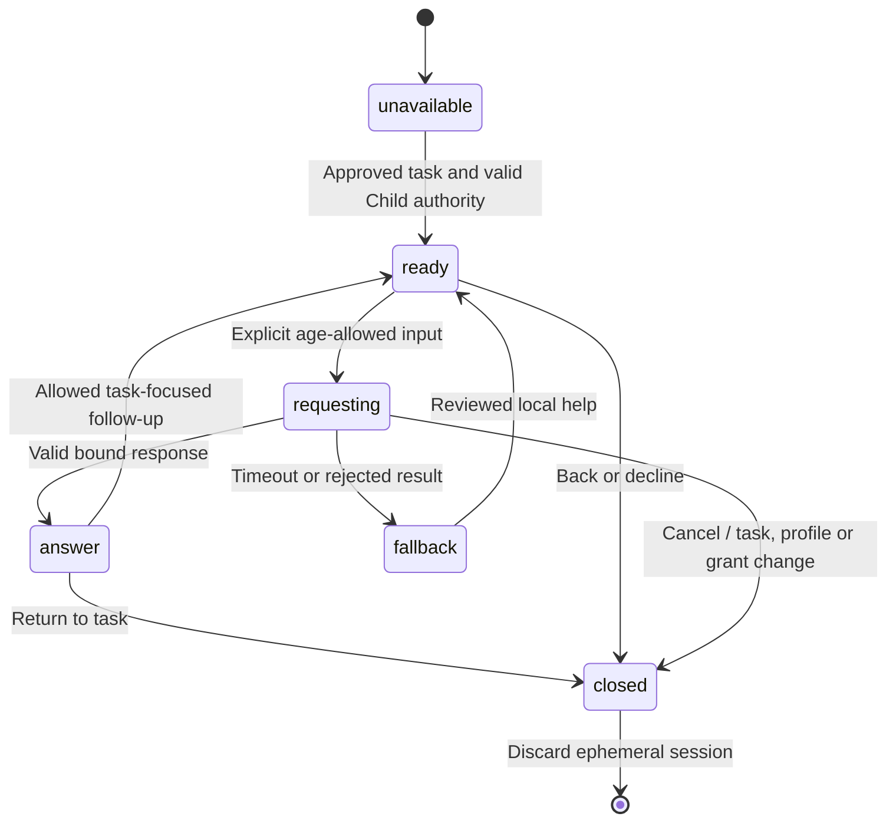
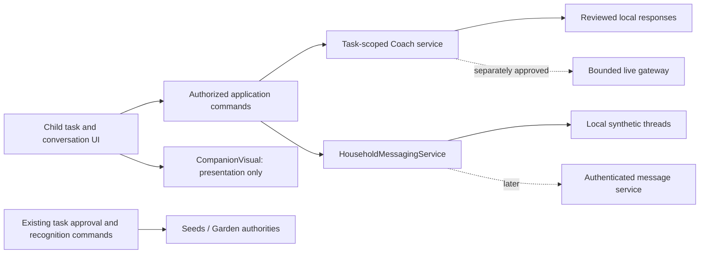
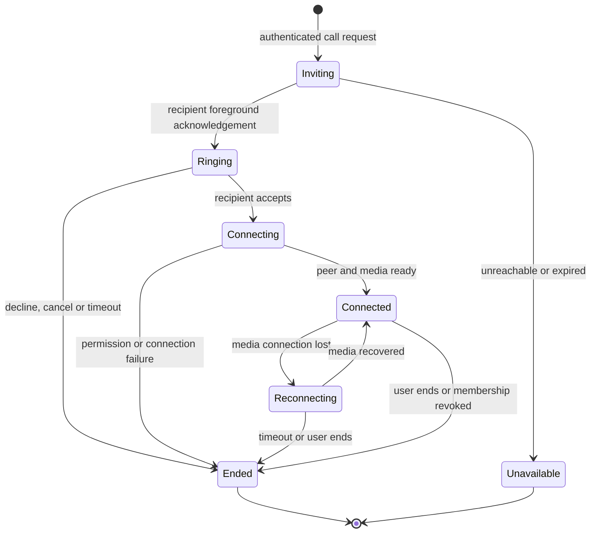

# Ghaf Child companion and family messaging — integration proposal

Prepared 2026-09-13 by Session C (`C-20260912T011718Z-root`) against shared
`redesign/ui-experiments` HEAD `f89f87a4f186eaa6fcebe67228da6dc49da249e3`, board 80.
**Status: researched proposal; no companion, messages, new goals or calling implemented.**
The user requested the plan. The user subsequently selected **real messaging between devices first** and confirmed
**“I have created it”** for the supplied artwork. Record the user/project owner as the
self-reported artwork creator; no legal name is invented. Deployment and exact runtime source
grants remain future implementation decisions. Current 5A logo, botanical identity and Parent
redesign remain intact.

**2026-09-13 extension:** the user also selected supplied messaging references as design input and
requested feasibility/design for Parent–Child internet voice/video calls and optional telephone
calling. Section 13 gives the concrete design and delivery sequence. Real text messaging remains
the first milestone; calling is additional planned work, not an existing capability.

## 1. Recommended product

Give the Child one recognizable **task helper**, tentatively labelled “Ghaf helper / مساعد غاف”,
and two clearly separate conversation destinations:

- **Family messages:** real human Parent↔Child conversation, with an optional task/goal reference.
  The Parent can offer practical support; the Child can ask questions or communicate outside a
  task. This is an actual messaging proposal, not merely a renamed “Ask an adult” notice.
- **Task-helper conversation:** a clearly labelled AI/prepared assistant for the selected,
  Parent-approved task or later approved goal. It explains, rehearses and helps plan a next step;
  the Child can return to the task or choose to contact a Parent.

Keep both accessible from the Child experience, with different headers, disclosures and state.
Do not put the assistant in the family thread as another family member. Do not feed family
messages into its prompt or make it impersonate the Parent. “Companion” describes the visual
guide; it does not promise a friend, confidant, therapist, human feelings or a relationship.

The useful product change is **Child choice → understandable step → request for support →
Parent reply → action → existing Parent confirmation**. The earlier reciprocal-family-agreement
proposal supplies this interaction rationale; it was not implemented or accepted by that report.
This plan does not claim the design improves cognition or family wellbeing. UNICEF's current
guidance emphasizes safety, privacy, transparency and inclusion and explicitly addresses Child
AI companions; those are design principles, not evidence of Ghaf's outcomes.
[UNICEF guidance, version 3](https://www.unicef.org/innocenti/reports/policy-guidance-ai-children).

## 2. What the supplied folder actually contains

Inspected `/home/smyk/projects/Ghaf/assets/character_companion` recursively, including hidden
files and generated output: **135 files, 118,586,154 bytes**. Build/cache content accounts for
111,708,683 bytes. The component's eight original artwork files total **6,603,457 bytes /6.30MiB**.
All eight match the supplied size/hash manifest; all 93 frames decode (90 animated +3 still).
Exact hashes, frame durations, alpha bounds and file inventory are in
`output/competition-readiness/companion-intake-20260913-c/inventory.json`.

| Material                                    | Verified content                                                                    | Integration decision                                                                  |
| ------------------------------------------- | ----------------------------------------------------------------------------------- | ------------------------------------------------------------------------------------- |
| Three 720×720 PNGs                          | Three poses of the same character, not three characters                             | Keep consistent identity; choose one neutral default after review                     |
| Five 720×720 GIFs                           | 18 frames each,80 ms/frame,1.44s encoded loop, unlimited repetition                 | Use only selected meaningful motions; stop by replacing with still                    |
| Flutter/Dart source                         | Self-contained image frame, local sequence, timer, animation and lifecycle handling | Reimplement the small presentation boundary in React Native; no Flutter host          |
| Docs/prompts/example/tests                  | API, extraction rationale, Flutter demo and12 documented tests                      | Use as inspected design evidence; embedded “implement” prompts are not task authority |
| `.dart_tool`, `build`, example compiled web | Generated dependencies, caches and duplicate assets                                 | Preserve originals; exclude from any proposed Ghaf runtime asset slice                |
| `:Zone.Identifier` sidecars                 | ZoneId3 only, no creator/source URL                                                 | Not artwork or licensing evidence; do not bundle                                      |

The character has dark hair, glasses, black face covering, cream shirt and rendered3D appearance.
It is raster artwork, **not** a mesh, rig, lip-sync system, emotion detector or voice agent. Its
visual identity is distinct from the new family-canopy logo; retain the logo as Ghaf's brand.

I read the component, asset and sequence code, both tests, demo, metadata, notices and integration
documents, and inspected all animation frames as contact sheets plus light/dark supplied previews.
Generated executables were inventoried/hashed, not run or represented as reviewed source. No
Flutter install, web build, imported script, browser or native process was started.

### Actual source behavior and what should change

The original component selects a portrait and activity independently, shows greeting 6s →
portrait 5s → activity 6s, repeats three 17s cycles, then randomly selects again. Repeats are allowed;
greeting is also in the activity pool. GIFs still loop every 1.44s, not every 6s. The frame is180dp
high, with20dp radius,2dp gradient border,160dp contained art and up to ±3dp continuous float.
Pause/reduced motion/background substitutes a still; resume restarts the retained phase's full
dwell. There is no phase callback, app state, AI, network, navigation, progress or chat contract.

| Asset          | Observed motion/pose                 | Recommended use                                                                 |
| -------------- | ------------------------------------ | ------------------------------------------------------------------------------- |
| `avatar3.png`  | Standing portrait, hand near hip     | Proposed neutral default; fixed pose, not a readout of Child mood               |
| `avatar2.png`  | Closer standing pose/hand gesture    | Alternative still for the same identity; preview at actual size                 |
| `avatar1.png`  | Folded arms                          | Retain source; avoid using as disappointment, refusal or judgment               |
| `greeting.gif` | Wave                                 | One short welcome after explicit helper opening, then still                     |
| `heart.gif`    | Hands form a heart                   | Defer from Child–AI chat; never affection/attachment reward or “I love you” cue |
| `running.gif`  | Running in place                     | Defer; unrelated to current recycling instruction and can imply urgency         |
| `walking.gif`  | Rhythmic whole-body arm/leg movement | Filename is not an instructional walking animation; defer                       |
| `swinging.gif` | Head/body sway                       | Defer continuous idle decoration                                                |

**Port the useful lifecycle and containment rules; do not reproduce the random 51s show.**
One fixed default reduces apparent identity/scale changes. All files share a canvas but have
different visible bounds; use contain-fit and a stable frame, not per-pose zoom/crop or mirroring.

The package includes an MIT software notice attributed to Ghiraas 2025. Its asset README explicitly
does not identify the artwork creator or a separate artwork license. Preserve the notice; software
licensing alone is not recorded here as proof of artwork provenance. The user confirmed on 2026-09-13 that they created the artwork and requested its use in Ghaf.
This resolves the open creator question through user attestation, not independent third-party
verification; retain the supplied software notice and record the actual creator attribution as
user/project owner until they provide a preferred credit. No artwork is copied into an app asset
registry in this planning task.

## 3. Existing Ghaf seams and genuine gaps

| Area                     | Current implementation                                                       | Consequence                                                                              |
| ------------------------ | ---------------------------------------------------------------------------- | ---------------------------------------------------------------------------------------- |
| Child Today/task         | `app/child/index.tsx`, `app/child/task.tsx`                                  | Existing approved task and support expansion are the first integration points            |
| Assistant identity       | `src/components/AssistantIdentity.tsx`                                       | Reuse purpose and prepared/live disclosure; character does not replace them              |
| Prepared Coach           | `ChildCoachService.respond`, `ChildCoachRequest`, `requestChildCoach`        | Real reusable contract; currently pinned to Salem's canonical9–11 recycling fixture      |
| Optional live Coach      | `GatewayChildCoachService`, Feature 004 Worker/text/voice candidates         | Code exists; flags/default provider/token/activation gates keep current runtime prepared |
| Current response         | One structured terminal answer, not transcript                               | Multi-turn context requires a new contract, not just bubble styling                      |
| Ask an adult             | Task route local UI state, optionally `need_adult` intent                    | Sends no Parent message today                                                            |
| Family connection ideas  | Private Parent planning, including suggested call/message activities         | No messaging transport or contacts authority                                             |
| Saved tasks/custom goals | Parent planning templates; no executable general-goal Coach repository       | New goal lifecycle/approved content contract required                                    |
| Storage                  | Local family/device/audio/saved-template repositories; transient Coach state | No inbox, thread, message delivery/read lifecycle or durable chat history                |

Read-only helper evidence: task route:141/575/604; models `familyGrowth.ts`:542;
service interfaces:240; store `usePrototypeStore.ts`:3913/3974; prepared provider:1343;
`liveChildCoach.ts`:44; `aiFeatureFlags.ts`:1; `PROTOTYPE_LIMITATIONS.md`:156/180.
Line references belong to inspected HEAD and may move. Prepared request acceptance rechecks Child,
assignment, task/version and demo-entry epoch. Live requests additionally check grant/notice,
request revision and applicable voice bindings. Reuse each path's actual safeguards.
Transport timeouts abort; clearing UI invalidates results, but does not by itself prove
screen-close transport cancellation. An explicit cancellation seam belongs in the new plan.

Feature 004 FR017–023 currently permits only approved chosen/in-progress tasks, age-bounded
input and one terminal card, with no cross-turn transcript, continuation, provider memory or
household history. A must amend the applicable contract for contextual chat. Feature 003's
exclusion of AI companionship remains: this proposal gives task assistance a visual identity,
without emotional-relationship behavior. Human messaging and a general-goal domain also require
new accepted stories. This report neither edits those authorities nor enables flags.

## 4. Proposed screens and navigation

Keep existing Parent and Child bottom destinations. Add contextual conversation entry points
after their contracts are accepted; do not create a competing navigation system.

| Surface                   | Composition and action                                                                                                                                                                               |
| ------------------------- | ---------------------------------------------------------------------------------------------------------------------------------------------------------------------------------------------------- |
| Child Today               | Approved task stays primary. Compact helper strip with stable portrait and “Help with this task”. A distinct “Family messages” action. No task: “Choose a task with your Parent”; no fabricated goal |
| Child task                | Preserve approved instruction, steps, safety and completion/help actions. Existing support entry opens the helper context for this exact task/version                                                |
| Helper conversation       | Back; character/name; “AI task helper” and prepared/live disclosure; pinned approved task; bounded response history; suggested follow-ups; “Message Parent” and “Back to task”                       |
| Child family conversation | Actual Parent display name, family-channel label, chronological human messages, optional task attachment, composer and explicit Send                                                                 |
| Parent Family/messages    | Separate Salem/Alya rows open their own threads. R2 is plain text; later authorized task attachments may open supported review routes. Replying never confirms a task                                |
| Parent task/goal detail   | Later contextual entry opens the correct human thread with a previewed draft. Attachments require a server projection contract; no automatic sending                                                 |

Use warm paper, forest accents, Readex body text and Alexandria headings. The character is
supporting content, not a180dp hero repeated on every screen. Start with a96–120dp figure when
introducing help and a compact still identity above conversation content; validate sizes on phone.
Human and AI channels differ by explicit labels/icons, not color alone. No contact discovery,
stranger messages, family leaderboard links, permanent floating chat head or fake unread badges.
Any future unread count must come from real per-recipient state; omit it in the first slice.

## 5. Parent–Child messaging contract proposal

Initial scope: one private thread per authorized Parent account and Child. The current demo has
one Parent principal, Salem and Alya. Optional second-guardian/relative names are directory
metadata, not authenticated messaging accounts; they cannot become recipients implicitly.
The Child can read their own thread; sibling threads and Parent-only notes are excluded.

The first real-device release (R2) is **plain text only**. Task/goal attachment cards are a later
addition after a server-authorized reference-projection contract exists. Parent composes ordinary text;
Child has quick phrases plus an age-appropriate human-message composer. Recommended 6–8 launch:
curated phrases;9–14: bounded plain text to their Parent, subject to a separately accepted
human-messaging policy. These are not AI input permissions: a family message never goes to the
model. Proposed limits: 500 characters/message, no attachments, links opening, recording or calls
in the first R2 release. The requested calling stages follow in section 13. Emoji/mixed scripts render safely as text. No automatic reply on the
Parent's behalf. A Parent can reply freely within the same message limit, not just acknowledge.

Local demo and real delivery are distinct implementations of one small service:

- **Explicit demo/test provider, not the selected first delivery:** session-local synthetic threads survive
  legitimate in-app role handoff, clear on reset/family replacement, and have a visible “Local demo
  on this device” notice. No server/delivery/read claim. Reload clears them; no durable draft promise.
- **Selected first delivery, real-device messaging:** identity and membership validated by a backend, authenticated send/list
  API, durable message/outbox policy, stable server ordering and idempotency. Begin with foreground
  synchronization; notifications, presence and typing are separately justified later. A failed send
  retains a draft only within the approved retention policy and offers Retry/Cancel.

Proposed remote states: `draft → sending → accepted_by_service`; timeout becomes
`delivery_unknown`, not definitely unsent. Retry uses the same client correlation key, allowing
the service to return the first result without duplicating messages. Definitive rejection becomes
`failed`, with an actionable reason. Display “Delivered” only after recipient acknowledgement;
omit read receipts initially. Message timestamps come from the service; a local optimistic row
has no authoritative sent time. On offline start, do not silently persist or send later unless the
approved outbox policy explicitly says so.

Send derives actor/household from trusted authority; a route's childId/sender string cannot
authorize delivery. Future task attachments contain a scoped ID/version and safe title projection,
not a mutable task object or award command. Deleted/stale attachments become “Task unavailable”
without leaking another profile. A text “done” or “approved” is conversation, not task completion.
For those later cards, the server must provision an immutable authorized reference projection
(or own the task domain). A device-supplied task ID/title is never proof of approval. R2 has no such
registry and does not accept task references. Received cards must not open or mutate an unrelated
local assignment on the receiving phone. The first companion-to-Parent bridge sends a previewed
plain-text request; no attachment or cross-device task synchronization is implied.

For real messaging, choose retention and deletion before release. Proposed working default:
30-day server retention and visible history boundary; immediate reset of local cached copies on
sign-out/replacement; logout does not pretend to delete server history. This default needs owner
review and service capability evidence. No end-to-end-encryption or confidentiality guarantee is
claimed without architecture and verification; transport/security design is part of that later
milestone. Blocking/reporting and trusted-adult alternatives for an unsafe household situation
must be reviewed before real Child data; a message to a Parent is not an emergency-response system.

## 6. Child–helper conversation contract proposal

Two deliberate stages avoid disguising a static answer as an open chat:

1. **Current-contract integration:** one Child intent and one terminal prepared answer using the
   existing Coach. Presenting these as two bubbles is acceptable if labelled prepared task help;
   there is no advertised remembered conversation or “ask anything” composer.
2. **Requested contextual conversation:** new contract for a short task-scoped session. Proposed
   budget: up to 3 Child turns/3 responses before a clear return-to-task action. Previous steps remain
   readable; relevant follow-ups reference the selected step. This is a per-session interaction
   bound, not points, scarcity or an engagement target. Further help and Parent contact remain
   available without loss. The limit is a proposed testable default, not a scientifically proven
   threshold or accepted product decision.

For 6–8 use icon/text intents;9–11 use structured choices such as “Which step?”;12–14 may use
guardian-enabled bounded text under the existing protections and new conversation contract.
The actual launch fixture remains Salem9–11; broad age policy does not make other tasks executable.
Initial multi-turn behavior can be a reviewed local decision tree. A later live operation remains
separate from both human messaging and the old one-shot endpoint; do not silently reinterpret
Feature 004's DTO. Start stateless at the provider: send a reviewed task archetype/version, current
intent and selected step, with only the explicitly approved minimal context. Any text-bearing
cross-turn history needs its own minimization/retention approval. Never send the family thread,
Child name, contact information, reward amount, household history or inferred emotional profile.

Suggested state machine:

All output is rendered after schema/correlation/task/age checks; stale completions cannot append
to a new Child or task. For the new conversation session, close, background, locale/task change,
revocation and reset cancel its pending work, invalidate its request revision and stop its owned
animation/audio. P1 preserves existing synthetic voice/task locale behavior; it does not reset
unrelated state. No catch-up replies or old draft
resurrection on reentry. The first chat session is ephemeral; no durable “memory leaf”.

The assistant should explain one useful step, preserve permitted help and always provide an exit
to an adult. Unsafe/off-topic requests get a brief reviewed boundary and safe adult route, without
asking for sensitive details. No secrets, emotional dependence, affection reward, diagnostic,
religious or medical authority. Neutral procedural praise can describe action/help-seeking.
Do not simulate typing while nothing is processing or animate a sad character after a pause.

**Sharing is explicit:** “Message Parent” opens a previewable human-message draft, identifies the
destination and requires Send. The default shared text is the Child's request for practical help,
not their AI transcript. No automatic Parent transcript dashboard or secret-memory claim. The
Child-facing privacy explanation must match actual storage and any safeguarding rules before
real data is enabled. Live voice/lip-sync is excluded from this text-first plan; existing voice
implementation candidates remain separately gated.

## 7. Goals: concrete extension without another authority

Start with the existing approved recycling task. Then define one small goal story: the Child
proposes an attainable action, the Parent reviews its wording and safety and offers a specific
support action, and the Child accepts or asks for an adjustment. The helper coaches only after
approval. Messages can discuss a goal before approval but cannot activate it.

Proposed goal states: `draft → parent_review → child_choice → active → awaiting_confirmation →
acknowledged`, with `revision_requested` and `paused` as neutral exits. Store a versioned approved
context and one active next step, not a screen-created reward or hidden assignment. Completion
uses an accepted task/learning/recognition command; the chat store never drives progress.

Example study goal: “Practise one difficult example and explain the strategy”; Parent support:
“I will listen to your explanation and help choose the next example.” This does not pay for
marks. Recommended first study/custom-goal slice is recognition-only: zero Seeds/Garden/League/
Family Reward progress. Any later eligibility remains explicit and category-specific. Feature 008
private family recognition stays zero growth. General goals, calendars and durable goal history
are dependencies to specify; existing Seed/canopy goal counters are not this goal model.

## 8. One bilingual storyboard and demonstration

The following is proposed MSA/English copy for review, not live localization resources.

| Moment                       | Arabic                                                                       | English                                                                        |
| ---------------------------- | ---------------------------------------------------------------------------- | ------------------------------------------------------------------------------ |
| Open helper on approved task | مساعد غاف · مساعدة مُعدّة لهذه المهمة                                        | Ghaf helper · Prepared help for this task                                      |
| Explain role                 | أساعدك في فهم خطوات المهمة. قد تكون المساعدة غير صحيحة. يمكنك سؤال شخص بالغ. | I help explain the task steps. The help may be wrong. You can ask an adult.    |
| Child chooses                | أحتاج إلى خطوة أبسط                                                          | I need a simpler step                                                          |
| Reviewed help example        | ابدأ بقطعة نظيفة فحصها شخص بالغ. اطلب مساعدته إذا لم تكن متأكدًا.            | Start with one clean item checked by an adult. Ask for help if you are unsure. |
| Bridge to family channel     | أرسل طلب مساعدة إلى وليّ الأمر                                               | Send a help request to Parent                                                  |
| Preview before sending       | هل يمكنك مساعدتي في هذه الخطوة؟                                              | Can you help me with this step?                                                |
| Parent replies               | سأفحص المواد وأرافقك إلى الحاوية الآمنة.                                     | I will check the items and go with you to the safe bin.                        |
| Child resumes                | العودة إلى المهمة                                                            | Back to the task                                                               |
| After actual submission      | بانتظار تأكيد وليّ الأمر                                                     | Waiting for Parent confirmation                                                |

The exact recycling wording must remain consistent with its approved safety content; this example
does not expand the accepted definition of done. Parent replies in the demo are explicitly entered
by the operator after authorized profile handoff, never fabricated as incoming human messages.

Suggested 150-second story, after implementation/native validation:20s Parent approves task;
30s Child chooses helper and understands one step;35s Child previews/sends and Parent replies;
25s Child returns and completes with permitted help;40s Parent confirms and presents the existing
12-Seed result. Default 48→60 Seeds/Mangrove48/60→60/60; the gated lifetime108→120fixture remains
different. For one-phone demo, show legitimate signed-out profile handoff; for real messaging,
demonstrate actual two-device send/receipt. Rehearsal timing is a target, not observed evidence.

## 9. Expo implementation strategy and proposed file boundaries

Use installed Expo Image, Tamagui, Reanimated, logical RTL helpers and existing native controls.
Expo documents GIF support and native animation methods. Web lacks those same method guarantees,
so replace the animated source with a PNG for stop/reduced motion on every platform. This is a
technical feasibility finding, not an Android decoder/performance pass.
[Expo SDK57 Image API](https://docs.expo.dev/versions/v57.0.0/sdk/image/).

Start with just a selected portrait and greeting in a future approved runtime asset slice
(about 1.79 MiB original bytes). Preserve manifest/notice and keep source assets unchanged. No
Flutter runtime, WebView,3D engine, Lottie, new chat SDK or animation library is needed for the
first local version. Existing `LocalIllustration` provides conventions but does not own animated
visibility/lifecycle control; build a small character-specific wrapper instead of assuming it
already stops GIFs. Do not clear shared caches or eagerly decode all five animations.

A 720×720RGBA frame is roughly 1.98 MiB; eighteen fully decoded frames are roughly 35.6 MiB before
other overhead. This is an arithmetic illustration, not measured decoder allocation. Test actual
memory on the phone, one animated instance at a time. A brief wave may use a bounded dwell and
then a still; do not claim frame-exact one-loop stopping until verified. Static fallback must
render immediately if motion preference is unknown/reduced or art fails. No action waits for art.

| Proposed seam, not a grant                                                                                | Responsibility / suggested owner                                                        |
| --------------------------------------------------------------------------------------------------------- | --------------------------------------------------------------------------------------- |
| `src/components/companion/{CompanionVisual,CompanionHelpEntry,CompanionConversation}.tsx`                 | C: small presentation props, existing text/controls, state accessibility                |
| `src/features/companion/{presentation,session}.ts`                                                        | B: deterministic pose/lifecycle and bounded conversation state, no award access         |
| `src/components/messaging/{ConversationHeader,MessageList,MessageComposer,TaskMessageAttachment}.tsx`     | C: plain-text rendering, composer/error/empty states; channels have distinct identities |
| `src/models/householdMessaging.ts`, `src/features/messaging/`, `src/services/mock/householdMessaging.ts`  | B: scoped DTOs, idempotency, authorized local thread/send commands, reset               |
| `app/child/{index,task}.tsx`, proposed `/child/messages`, `/child/helper`, `/parent/messages` route files | A: exact route/access integration; deep-link/Back guards before C screen wiring         |
| Existing service interfaces/registry/store, localization/assets/config                                    | A: accepted transfers only; adapt existing aggregate rather than new parallel authority |
| Worker/remote service and token broker                                                                    | A/B later: separate messaging trust boundary and separately versioned Coach operation   |
| New goal contract/module and reviewed content                                                             | A product authority/B domain; independent of visual character and chat                  |
| Scoped unit/rendered/state tests and device evidence                                                      | Assigned implementer tests; D independent integrated/native review                      |

`CompanionVisual` receives only asset/pose, presentation phase, visibility, reduced motion and
optional accessible label. It never receives a full Child profile, provider key or completion
callback. Conversation application commands derive authority; `sendMessage` accepts thread reference,
plain text, optional safe task reference and correlation ID, not trusted sender/household/status.
Human messages and Coach turns use separate DTOs, stores and retention rules even if some row
layout primitives are shared. Reuse existing registry/provider replacement patterns.

## 10. Implementation queue and acceptance

Relative effort reflects new seams, not a calendar promise. **The user selected real messaging
between devices first.** It is the first acceptance target; the local provider is explicitly
for demo/tests and cannot stand in for real transport. Companion presentation can be developed
independently alongside the message foundation, then join the real two-phone story.

| Stage                             | Deliverable                                                                                                                           | Dependencies / relative effort                                                  |
| --------------------------------- | ------------------------------------------------------------------------------------------------------------------------------------- | ------------------------------------------------------------------------------- |
| R0 Contract and deployment design | Real messaging story, server identity/membership/device model, retention and age-composer policy, hosting/auth decision, exact grants | A/user decisions; medium planning slice; user-created artwork recorded          |
| R1 Remote messaging foundation    | Authenticated Parent, enrolled Child device, private threads, durable messages, stable cursor/idempotency and access revocation       | R0, server/database/managed-auth boundary; large                                |
| R2 Real two-device conversation   | Parent↔Child plain-text UI, truthful send/failure states, foreground synchronization, keyboard/Back/accessibility                     | R1; first delivery acceptance; medium–large                                     |
| C1 Companion with existing Coach  | Selected portrait/brief wave on approved task, one prepared exchange, explicit message-draft bridge                                   | Can run beside R1; no live-AI activation; small–medium                          |
| C2 Bounded contextual helper chat | Short reviewed follow-up tree, task context, ephemeral history and explicit share                                                     | Amendment to004 terminal/no-history contract; medium                            |
| G1 One custom-goal story          | Child proposal, Parent support/approval, Child choice and recognition-only completion                                                 | New goal authority/reviewed content; medium–large                               |
| A1 Optional live multi-turn Coach | Versioned gateway, trusted broker, purpose grant, provider/retention and fallback evidence                                            | Separate004 amendment/activation; large; not required for real family messaging |

The local synthetic provider remains useful for automated tests and explicitly selected offline
demos. A real send failure stays unknown/failed with its original idempotency key; it never becomes
synthetic success. Recovery 014 remains deferred. Message persistence is now an explicit new
messaging requirement; it does not implicitly authorize persistence of task/Seed/goal authority.

**First acceptance story:** use two installations and synthetic family profiles with real
server-backed sessions. Parent on phoneA sends a text; Salem on phoneB receives it from the service
and replies; phoneA receives that reply. Repeating a timed-out send creates exactly one message.
An unauthorized or revoked device cannot list/send, and Alya's thread remains inaccessible to
Salem. Airplane mode shows unsent/uncertain state honestly and recovery retrieves the actual
server history. App restart restores authorized message history under the selected retention
policy. No Seed/approval/Garden state changes. This is actual transport, not prerecorded incoming
messages or a local role toggle.

**Connected companion story:** after C1 joins R2, the Child opens prepared helper on an approved
Salem task, chooses a simpler explanation, previews a request, then sends it through the real
family channel. Parent receives it on the other phone and enters a reply. Child resumes the same
approved task; the accepted 12 Seeds remain controlled solely by existing recognition. C2 adds true
bounded follow-ups only after its new contract. Do not imply current task/progress state has
cross-device synchronization: the first messaging release transports plain text, not task reference cards, assignments or awards. If both phones must share live task
lifecycle, that is a separate server-backed task synchronization contract and acceptance slice.

### Remote architecture needed for R1–R2

Recommend a small authenticated message API with a relational message/membership store and managed
identity. Reuse the repository's typed service/validation style. The existing AI Worker is useful
infrastructure precedent, not an already-approved family-message backend or production identity
provider. Hosting/auth provider selection and its account/deployment approval are an R0 decision;
this plan does not provision a service or add an SDK. Keep an HTTP adapter replaceable through the
existing registry. Do not build a new password/identity system inside screens.

- **Parent identity:** genuine server-verified session; the demo profile selector and deterministic
  OTP are never accepted by the real message API. Real test traffic uses synthetic household
  content with properly authenticated team-controlled sessions.
- **Child enrollment:** Parent creates a short-lived, single-use device invitation; Child installation
  redeems it through the trusted access flow and receives a scoped, revocable session for that
  Child only. The server controls household membership, expiry and revocation. A typed nickname or
  client-provided role cannot mint membership. Persist native session material only through the
  selected secure-storage/auth mechanism, not the prototype's remembered-device marker.
- **Records:** household membership; authorized device/session reference; one Parent–Child thread;
  immutable messageID/threadID/senderMembershipID/body/serverTime/serverSequence;
  client idempotency key unique per sender; explicit deletion/retention state. No AI transcript
  table is required for this milestone.
- **API:** authorized thread listing; paginated message retrieval by server cursor; idempotent message
  send; device invitation/revocation through the access service. Authentication determines actor;
  all thread membership checks occur server-side. Task-reference cards remain deferred until an
  authoritative reference projection is specified; no device-minted approval claims are accepted. Message insert and its stable
  sequence/idempotency result are one transaction.
- **Synchronization:** fetch on conversation entry and resume; bounded foreground polling while a
  thread is visible is sufficient for the first small deployment. Proposed target: visible messages
  arrive within 5 seconds under the measured test network. A documented later switch to authenticated
  realtime transport should not change message DTOs or authority. No continuous background polling,
  push permissions, online presence or read receipts are needed for first delivery.
- **Restart and failures:** server history survives restart; local cache/outbox has an explicit
  bounded retention policy. Revalidate authentication before displaying cached private content.
  Network loss preserves only an authorized draft/uncertain-send record and never fakes delivery.
  Revocation clears the local private view and pending operations; reset clears local data and
  does not pretend to erase remote messages without an authorized server deletion operation.

The current app's one-local-family model must be extended deliberately to reference server
membership. Do not replace existing demo authority with a weak hybrid. R0 specifies distinct demo
and real messaging configurations, adapter selection and clear visible environment labels during
team tests. Real messaging can ship while AI remains prepared; their permissions and infrastructure
are independent. Two-device task synchronization and Child live-AI activation are not smuggled into
R2 just because chat transport works.

## 11. States, failure cases and checks

- **Visual:** idle/wave/still/asset loading or failure; no continuous decoration; close/background/
  reduced motion cancels deadlines and switches to still. No character-only status information.
- **Task helper:** no approved task, eligible task, asking, answer, prepared fallback, adult exit,
  end-of-session, changed task/version/profile/grant and replay rejection. Pending confirmation
  offers truthful status/adult contact rather than continuing an ineligible live task session.
- **Messaging:** empty own-thread, editable draft, disabled blank Send, sending, locally stored or
  service-accepted, unknown outcome, definite failure, unavailable attachment, revoked access,
  cleared/reset session. No fabricated incoming message, unread count or online indicator.
- **Authority:** wrong household, sibling, forged sender, stale attachment, role handoff, duplicate
  retry, sign-out/reset during pending send, late Coach response and changed goal/version. Conversation
  must leave Seeds/Garden/League/Reward/approval state byte-for-byte unchanged.
- **Privacy:** render plain text safely, never execute message markup/links; minimize server/log content;
  no AI ingestion of direct messages; no private material in league/profile previews. A resource
  control or moderation failure does not silently drop a human message labelled delivered.
- **Arabic/accessibility:** RTL start/end, unmoved artwork, direction-aware Back/Send, bidi-isolated
  names/timestamps, equal copy meaning, wrapped long text,48dp controls, clear selected/focus states.
  Reading order is channel → participant → context → messages → composer/actions. Announce new
  messages only when appropriate and preserve screen-reader place; no per-frame announcements.
- **Keyboard/scroll:** composer remains reachable with Android keyboard; Back dismisses keyboard then
  returns through the expected route. New replies do not yank a reader from older content; show a
  truthful “new message” control when needed. A draft never appears under another Child.
- **Evidence:** meaningful store/service/rendered tests; one batched AR/EN320/390 browser matrix;
  direct Android large text/TalkBack/Back/keyboard/background/reentry/decode/memory checks. Verify
  real cross-device exchange only against the installed, identified remote candidate. Do not
  reuse the supplied Flutter 12-test/browser record as Expo or native acceptance.

Existing Coach suites to extend after ownership assignment include `live-child-coach-store`,
`live-child-coach-ui`, `child-ai-presentation`, `assistant-voice-session`. Do not add tests that
only mirror component styling. No runtime tests were necessary or run for this read-only plan.

## 12. Decisions, contribution and handoff

**Selected:** the user requested the task/goal helper and both chat channels, explicitly chose
**real messaging between devices first**, and confirmed they created the supplied artwork. The later
request adds reference-led messaging design and feasibility for human internet voice/video and
optional telephone calling; the technical provider and release stages below are recommendations.
**Recommended, not selected:** neutral portrait, brief wave, text-first human messaging,
ephemeral bounded helper history, the proposed message limits/retention and server architecture.
**Pending:** preferred creator credit and final character name/portrait, hosting/auth/deployment
decisions, message retention and age-composer policy, A's amended contracts/exact grants, named
student ownership, Arabic copy and safeguarding/privacy review, actual devices and native checks.
Creator confirmation resolves the earlier asset-provenance question; the earlier initial prompt
and unanswered-question snapshot remain historical evidence, not the current decision.

Skills: Ghaf reference intake and Impeccable Shape; incumbent design-system conventions reused.
Lead inspected the package/assets, drafted storyboard/architecture/acceptance and prepared evidence.
One helper `/root/companion_chat_seams` traced current code read-only and corrected a stale premise:
Child live adapters exist, while current activation and contextual chat do not. It also confirmed
Ask-adult has no messaging transport and mapped one-shot/cancellation boundaries. Helper released;
no descendants, source writes or jobs. Exact prompts/contributions/rejected directions are in the
ignored packet's assistance record. Requested GPT-6 Astra/Ultra/Fast; helper launch was
`gpt-6-astra`/`ultra`, effective Fast/serving settings unexposed. Human review is not fabricated.

Reused existing research/product strategy, template catalog, A service/access review and C's
reciprocal-story proposal. Dailoz supplies task hierarchy, Notes supplies quiet reading rhythm,
Edulive supplies finite steps; none authorizes copied assets, messaging or new goals. No new
scientific outcome claims or interviews. The user retains originals; source files and active
Metro/native resources are unchanged. Only this report, inspection packet and C status were written.

A receives this concrete proposal for acceptance/amendment and scoped task generation. Commit only
the report through the coordinated shared index; do not stage the unreviewed character folder or
audio files with it. No runtime grant, release activation, deployment, paid service or provider
call has been made. Further implementation starts from the accepted next slice, not from the
third-party reproduction prompt.

## 13. Messaging references and Parent–Child calling

### The visible job and selected reference patterns

Mode: **Operate**. A Child who needs practical help should identify the Parent, send a message,
and later choose a clearly named call method without confusing that person with the AI helper.
The Parent should open the correct Child's conversation and respond without granting an award.
Preserve the selected 5A mark, calm botanical surfaces, Alexandria/Readex and current Tamagui
tokens. Keep conversation content dominant; use the character only in the helper destination.

The existing inspection of all 13 templates identifies **no complete conversation, composer,
incoming-call, active-call, video-call or dialer artboard**. These specific patterns are usable:

| Inspected reference and exact source                                                                                                                  | Observed pattern                                                                                             | Ghaf adaptation / exclusion                                                                                                                                                        |
| ----------------------------------------------------------------------------------------------------------------------------------------------------- | ------------------------------------------------------------------------------------------------------------ | ---------------------------------------------------------------------------------------------------------------------------------------------------------------------------------- |
| `booking-ui-components-hoangpts`, board `0CE97DC6-CECF-4B96-AC06-8D38105C51A6`, driver group `C7B46AB2-305D-406E-8920-2ECD0B33F2C2`                   | 448×309 identity/status panel; filled Message 258×58, outlined Call 134×58; both visible in embedded preview | Identify the actual family member first; make Message primary. Separate internet voice, video and telephone actions. Exclude map, ratings, arrival estimate and imported portraits |
| `virtual-currrency-wallet-juraa`, `Transfer contact`, board `43A4386A-1913-4FA6-AE7D-BCCB5187E505`, drawer `54B60E9B-630F-4E87-A143-67B0D0E542D4`     | Recipient avatar/name/detail rows, first row 375×60; drawer visible in preview                               | Approved household recipient rows with relationship labels. Exclude transfer amounts, emails, imported contacts and Favorite/Normal ranking                                        |
| `bank-mobile-app-template-gokul`, `Contact List` symbol `99A86C5C-8007-4F15-B845-2DA60C76E4C0`, transfer board `9066335B-E89C-497A-8CD8-2383D31E0F60` | Name/number row anatomy in JSON; preview only shows QR, so contact composition is not visually validated     | Structural reference for optional private contact detail only; no contact search/import/invite or copied numbers                                                                   |
| Notes `card/audio` symbol `6EB67300-5C6E-401B-9075-D390D367CA8F`; Music `Now Playing` `40:1`                                                          | Playback/text grouping, not calling; Notes play disk is only 30×30                                           | Optional future reviewed narration grouping only; enlarge touch targets. No voice-note or call waveform inferred                                                                   |

Lead viewed the existing Booking and Wallet previews; the helper recovered its completed structural
review. Source JSON is under `output/competition-readiness/sketch-inspection-20260912-c/<slug>.json`;
original embedded previews are under `output/competition-readiness/template-review/extracted/<slug>/sketch/previews/preview.png`.
Nothing was re-extracted or executed. Dailoz's Message icon is email login, Uber's inbox is a
navigation label, and Edulive video icons are lessons. They do not supply chat functionality.
Redistribution rights remain unestablished; Music states personal-use permission. Use composition
ideas, not imported source, artwork, fonts or sample personal information.

### Concrete screen composition and bilingual actions

| Surface                      | Reading order and primary action                                                                                                                             | States and adaptation                                                                                                                                                       |
| ---------------------------- | ------------------------------------------------------------------------------------------------------------------------------------------------------------ | --------------------------------------------------------------------------------------------------------------------------------------------------------------------------- |
| Parent Family → Messages     | Heading, authorized Child rows with name/relationship, real latest message if policy permits; tap row opens that thread                                      | Empty/loading/error/revoked membership; no invented unread number, online dot or contact discovery. Preview suppression for privacy is explicit                             |
| Child → Parent conversation  | Back, actual Parent identity, conversation, quick phrases, draft and Send; call methods appear only after their milestone is available                       | Bubble alignment follows logical own/other sides; sender labels and status text supplement color. Text uses content direction, isolated numerals and links rendered as text |
| Human thread contact actions | Message remains the main task; labelled internet voice/video controls and a separate “Call by phone” item                                                    | At 320 probe width or enlarged labels, stack controls below identity. Unsupported methods are omitted; temporary errors explain recovery without implying availability      |
| Child task helper            | Character still, “AI task helper”, current approved task, finite help choices/reply, Return to task and Message Parent                                       | No human-call buttons, presence claims or family-message ingestion. Message Parent opens a visible draft in the human thread                                                |
| Incoming internet call       | Known family identity, explicit voice/video type, Accept and Decline, optional answer without camera                                                         | No microphone/camera capture merely because the screen appeared. Equal accessible action names; Back declines this call only after the calling contract defines it          |
| Active voice/video           | Peer identity and actual call state; remote picture only when received; own camera preview when intentionally enabled; stable Mute, Audio route and End call | Connection loss replaces duration with recovery status; camera-off uses a neutral identity placeholder. No stock photograph pretending to be live video                     |

Use at least 48dp targets, clear pressed/disabled/selected states, equivalent text labels and
wrapping Arabic. The composer grows to a bounded number of lines then scrolls internally; the
message list yields space to keyboard, draft and Send. Blank Send is disabled. Retain draft across
temporary keyboard/route transitions within the accepted retention policy. Back first dismisses
the keyboard, then returns to the prior route; active-call Back offers Stay/End in the foreground
milestone. TalkBack order follows header → message chronology → quick choices → composer → Send.
Do not announce every message on initial history load or replay narration over a screen reader.
Reduced motion removes decorative transitions and exposes the same actions promptly.

Proposed resource pairs, pending incorporation by A; these are design copy, not a second locale authority:

| English                                          | Modern Standard Arabic                                 |
| ------------------------------------------------ | ------------------------------------------------------ |
| Family messages / Message / Send                 | رسائل العائلة / إرسال رسالة / إرسال                    |
| Internet voice call / Video call / Call by phone | مكالمة صوتية عبر الإنترنت / مكالمة فيديو / اتصال هاتفي |
| Incoming voice call / Incoming video call        | مكالمة صوتية واردة / مكالمة فيديو واردة                |
| Accept / Decline / End call                      | قبول / رفض / إنهاء المكالمة                            |
| Answer without camera / Turn on camera           | الرد دون كاميرا / تشغيل الكاميرا                       |
| Microphone muted / Reconnecting                  | الميكروفون مكتوم / جارٍ إعادة الاتصال                  |
| Open phone app / Send a message instead          | فتح تطبيق الهاتف / إرسال رسالة بدلًا من ذلك            |

### Three calling methods with different requirements

**Internet voice and video:** feasible candidates for a separate human calling service. LiveKit is
the first technical candidate to evaluate: its Expo integration uses native WebRTC packages and
plugins and requires a custom build, not Expo Go. Ghaf's exact Expo/React Native compatibility,
Android media behavior, provider region, operating cost and hosting terms remain unverified.
No SDK is selected or installed. [LiveKit Expo documentation](https://docs.livekit.io/transport/sdk-platforms/expo/).

Use a service boundary such as `FamilyCallService`, separately from AI and plain-text transport.
The backend authorizes the exact Parent/Child membership and call before issuing short-lived,
room-scoped participant tokens. Provider tokens carry room/participant grants; they do not replace
Ghaf's membership checks. Keep signing secrets server-side. [LiveKit token documentation](https://docs.livekit.io/frontends/reference/tokens-grants/).

The proposed backend owns invitation/acceptance/cancellation and a call revision; the RTC provider
carries media after acceptance. Allow only the two authorized people, one active call per account,
no public room links and no companion participant. A call is connected only after peer/media
events establish it. A service accepting an invitation does not establish that the other phone rang.
Expire unanswered invitations; resolve simultaneous calls, duplicate accepts and late accept after
cancel idempotently. Membership revocation ends media and prevents fresh join tokens.

Request microphone/camera permission at the explicit call/accept action. Do not publish either
party's media before acceptance; a local video preview requires that person's explicit action.
Camera denial offers audio-only or messaging; microphone denial offers messaging. Video upgrade
never turns on the other person's camera. No recording, transcription, emotion analysis, AI
listening, background listening or automatic answering is proposed. Interruption/sign-out/revoke
must cancel pending work and release tracks, room connections, audio sessions and listeners.
Pause existing narration/ambience while calling; any restoration respects its prior user setting.

The first calling milestone is explicitly **foreground-only**: leaving/backgrounding the app ends
the call and stops media, with this limitation explained before starting. Do not claim closed-app
ringing. Background/locked-screen incoming calls need a later native OS calling/notification design,
platform-specific push/signaling, audio focus and lifecycle evidence. An ordinary message poll is
not a background calling implementation.

**UAE availability gate:** TDRA treats internet voice/video calling as regulated VoIP. The team
must establish provider/service eligibility and test the actual intended networks before offering
Ghaf internet calling as available. SDK support or a successful test elsewhere proves neither.
This gate does not hold up the real text-message milestone. [TDRA internet guidelines](https://tdra.gov.ae/en/About/tdra-sectors/information-and-digital-government/departments/policy-and-programs-department/internet-guidelines).

**Telephone calling:** offer “Call by phone” only for a Parent-managed contact whose intended recipient the Parent confirms
number and an available phone-app handler. Existing Child profiles have no phone-number authority;
the Parent's sign-in identifier is not automatically a contact number. Add a private, versioned
contact field only through an accepted contract, with Parent reauthentication for edits, explicit
person binding and clear masked display. Never read SIM contacts, call logs or a Child's number
automatically; exclude contact numbers from AI context, League and routine logs.

Use the existing `expo-linking` capability for a `tel:` phone-app handoff where native behavior
meets the contract; inspect Android query configuration. Require the system dialer and the user's
final call action. Android's `ACTION_DIAL` avoids the `CALL_PHONE` permission needed for direct
`ACTION_CALL`. If the existing linking adapter cannot guarantee the required handoff, an exact
native/config grant is needed. Handler availability does not prove a valid number, SIM, coverage
or connected call. Show no call duration/delivery claim after returning to Ghaf. Telephone calls
use the device's carrier/service and may incur its normal charges. [Expo linking](https://docs.expo.dev/linking/into-other-apps/),
[Android permission guidance](https://developer.android.com/privacy-and-security/minimize-permission-requests).

### Delivery additions and smallest acceptance

| Order                                | Concrete addition                                                | Dependencies / relative effort / evidence                                                                                                                                                 |
| ------------------------------------ | ---------------------------------------------------------------- | ----------------------------------------------------------------------------------------------------------------------------------------------------------------------------------------- |
| R0 → R1 → R2                         | Existing real identity/membership and two-device plain-text plan | First acceptance target remains unchanged; no call controls during text-only release                                                                                                      |
| T1, after R2 or alongside foundation | Optional approved-number phone-app handoff                       | Private contact authority, capability/intent handling; small UI, medium identity/contact work. Native handler/cancel/return/no-number tests; no actual call without device-owner approval |
| V1, after R2                         | Two-person foreground internet voice call                        | Calling contract, service eligibility, invitation backend, token service, native SDK/build and permission/audio lifecycle; large. Two real devices across intended networks               |
| V2, after V1                         | Optional internet video and audio-only answer                    | Camera consent, media lifecycle, bandwidth/battery/thermal and orientation checks; medium–large increment. Both parties explicitly control their own camera                               |
| V3, later                            | Background/locked-screen incoming call support                   | Separate OS calling and push integration, interrupted/terminated app evidence; large. Not promised by V1/V2                                                                               |

Calls do not add task synchronization, Parent task confirmation, goal completion, points or growth.
The optional goal and multi-turn AI proposals stay separately contracted; they are not prerequisites
for human messages/calls. The current P0 networking/media limits require a new accepted feature
contract before runtime work; this report records the user's new direction without silently changing P0.

Proposed exact seams for A to reconcile, **not current grants**: `src/features/familyMessaging/`
for the thread service/controller, `src/features/familyCalling/` for call state and media adapter,
`src/components/familyMessaging/` and `src/components/familyCalling/` for bounded UI; A owns role
routes, session/registry, bilingual resources, private contact model, config/dependencies and the
server contracts. The call manager owns one media lifecycle outside the screen render; components
consume state and callbacks. Backend hosting location is an architectural decision, not assumed
to belong inside the existing AI gateway. D owns independent integrated/native acceptance.

For V1 acceptance, Parent on phone A calls the enrolled Child on phone B, both foreground. The
Child accepts; each hears the other, mute/audio route work, and either can end. Repeat only to
cover permission denial, decline, busy, timeout, connection loss, late accept/cancel, foreground
exit, reentry and revoked membership. V2 adds camera-off/audio-only, intentional upgrade, camera
switch/orientation and visible media cleanup. Capture actual model/OS/font/network/candidate and
localized state screenshots; do not record family audio/video merely to produce QA evidence.
Native TalkBack, keyboard, Back, font scaling and audio routes are NOT RUN here.

**Review and release:** user intent and permission to use reference patterns are recorded; final
screen composition, Arabic resource diff, contact/retention policy, provider/region choice, exact
implementation contracts, student teach-back and phone acceptance remain pending. Lead authored
this amendment, helper `/root/sketch_pattern_review` supplied the completed reference inventory,
and lead inspected two existing previews. No helper source writes or deeper spawning. Rejected:
calling all icons a messaging kit, importing finance/ride assets, AI calls, automatic cameras,
fake ringing/read/online indicators, and presenting foreground support as closed-app calling.
Requested Astra/Ultra/Fast; previous helper launch recorded Astra/Ultra, resumed helper reports no
settings changes and Fast unobservable. Root effective serving settings are not exposed.
The ignored `output/competition-readiness/messaging-calls-20260913-c/` packet preserves prompts,
reference IDs, official sources and bounded validation. Its [paired Arabic/English screen board](../../../output/competition-readiness/messaging-calls-20260913-c/index.html)
contains eight static design sketches; these are not captures of an implemented app. This is a
design handoff, not an APK or implemented communication service.
