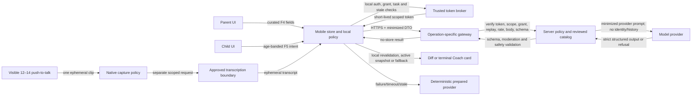
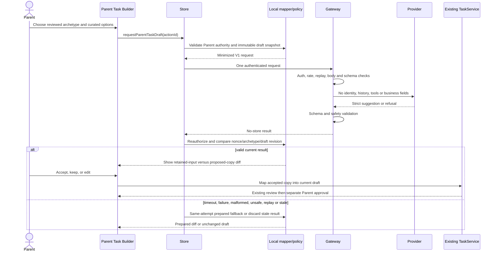

# AI Features 4–5 Approval and Activation Packet

**Date**: 2026-09-07

**Repository state reviewed**: `b55d584` on `integration/r3-complete-screens-20260905`

**Proposal commit approved**: `ffe4dd7`

**Status**: ALL THREE APPROVED FOR DEFAULT-OFF IMPLEMENTATION — ACTIVATION BLOCKED

**Evidence reconciliation — 2026-09-10**: All 87 implementation tasks are complete in
[`tasks.md`](tasks.md), whose evidence log records the focused, full, and fake-provider checks.
This packet preserves the original proposal and activation-review controls. Its proposal-time
`NOT RUN` and `NOT STARTED` implementation rows are historical, not the current code status.
Provider, deployment, native, named-human, and release gates remain unpassed. The active Spec Kit
pointer now selects Feature 005 remembered device access; Feature 003 remains the product baseline.

The product owner answered **"all three"** on 2026-09-07. This records implementation
authorization for three independently controlled stages:

1. **F4** — Parent task drafting.
2. **F5-TEXT** — live Child Coach text/structured interaction.
3. **F5-VOICE** — visible one-shot push-to-talk and transcript review for eligible ages 12–14.

The Feature 003 deterministic journey remains authoritative and complete. At proposal time,
`.specify/feature.json` and the Spec Kit-managed `AGENTS.md` block remained pointed at
Feature 003 pending the Feature 004 planning workflow. Approval authorizes
default-off code and synthetic/fake-provider or native-media harness tests only. It does not
authorize deployment, a real provider call, real Child data in testing, or release activation.

## 1. Repository-grounded gap analysis

### Evidence inspected

- Current boundaries: `src/models/familyGrowth.ts`, `src/features/tasks/`,
  `src/features/assistants/`, `src/services/interfaces/index.ts`, `src/services/mock/index.ts`,
  `src/services/remote/GatewayParentGuideService.ts`, `src/state/usePrototypeStore.ts`,
  `src/components/family-growth/ParentTaskComposer.tsx`, `src/i18n/resources.ts`,
  `workers/ghaf-parent-guide/`, and focused task/assistant/access/privacy tests.
- Historical branch `origin/002-ghaf-core-mvp`: `src/features/missions/`, `src/features/ai/`,
  `src/services/remote/GatewayAIService.ts`, `workers/ghaf-ai/`, `docs/AI_SETUP.md`, models,
  service registry, and mission/Coach tests.
- Current product authority: Feature 003 spec/plan/tasks, constitution, product/research/design,
  limitations, ownership, and demo evidence.

### Historical incompatibilities

| Historical behavior                                                                                                                                     | Why it cannot be reused                                                                                                                                         | Required replacement                                                                                                                                               |
| ------------------------------------------------------------------------------------------------------------------------------------------------------- | --------------------------------------------------------------------------------------------------------------------------------------------------------------- | ------------------------------------------------------------------------------------------------------------------------------------------------------------------ |
| `GeneratedMissionPayload` let the model produce story, steps, reflection, impact quantity, evidence method, reward, and personalization                 | Current Feature 003 keeps reward, evidence, category, safety, privacy, recognition, phase, landscape, Circle, League, and Family Reward decisions deterministic | A copy-only `ParentTaskDraftSuggestionV1` plus a mapper that retains an immutable `TaskTemplate` authority snapshot                                                |
| `MissionInput` was food-rescue-specific and included Child ID, prepared image/voice IDs, quantity, time, reward, and timestamps                         | It is obsolete, over-collects for drafting, and does not map to the current `Task`/`TaskTemplate` lifecycle                                                     | Curated archetype, coarse age band, effort/support enums, random per-request binding, and no identity/media/reward fields                                          |
| The old mission lifecycle was `draft-input → generating → parent-review → assigned → child-in-progress → awaiting-parent-confirmation → completed`      | Current lifecycle separates draft/review/assignment/Child choice/start/submission/Parent praise/recognition and guarantees zero early reward                    | Insert a suggestion diff before the existing draft/review transition; do not create a second lifecycle                                                             |
| `AIService` combined mission generation and Child Coach in one broad interface                                                                          | It couples different audiences, data, permissions, fallback, and release risk                                                                                   | Independent `ParentTaskDraftingService` and `LiveChildCoachTextService`; prepared services remain separate defaults                                                |
| `GatewayAIService` accepted any absolute HTTP or HTTPS URL, posted both operations to one endpoint, used an 8-second timeout, and sent no authorization | It allows downgrade to HTTP, lacks scoped auth, has a long demo-blocking wait, and has no operation-specific boundary                                           | HTTPS-only exact routes, short-lived scoped credentials, bounded deadlines, no automatic retry, and independent rate/budget policies                               |
| Old Worker CORS used `Access-Control-Allow-Origin: *` and accepted one public URL                                                                       | A browser origin is not authorization, wildcard CORS broadens abuse, and originless native requests were not authenticated                                      | Exact web-origin allowlist, auth required for all requests, and explicit treatment of missing native `Origin` as neutral—not trusted                               |
| Old Worker had no endpoint authentication and only documented future account-level rate limiting                                                        | Anyone who discovered the URL could spend quota or exercise Child operations                                                                                    | Verify issuer/audience/scope/role/grant before parsing/inference, then per-subject/tenant/operation rate, daily budget, and concurrency limits                     |
| Old Worker body cap was 32 KB and trusted declared length before reading                                                                                | Declared length may be absent or false and the payload is larger than necessary                                                                                 | Small operation-specific limits checked both before and after the bounded read                                                                                     |
| Historical Coach accepted up to 500 characters for every band, including `voice-transcript`, and sent `childId` plus full task text                     | This violates current 6–8 and 9–11 input policy, over-shares identifiers/content, and couples recording directly to generation                                  | Per-band request schemas, server-owned reviewed task context, no free text below 12, and an independently gated 12–14 transcript-review voice path                 |
| Historical Coach used regex checks and accepted broad free-text/code-switching                                                                          | Regex is a useful fail-closed layer but not a complete semantic, multilingual, adversarial, or crisis safeguard                                                 | Curated/structured inputs, local and server validation, provider moderation where approved, semantic output policy, red-team corpus, and deterministic termination |
| Historical prompt allowed a light Gulf greeting                                                                                                         | Current safety copy requires Modern Standard Arabic; dialect, gendered, cultural, and religious variants need named review                                      | MSA-only safety contract until a named human review approves a specific variant                                                                                    |
| Old output schemas echoed task/request IDs but had no consent version, access/session authorization, replay control, or stale profile binding           | A matching string does not establish the current Child/task/grant authority                                                                                     | Random nonce plus local task/profile/draft/grant snapshots, short-lived credential `jti`, replay cache, cancellation, and post-response reauthorization            |
| Historical setup placed only a Worker URL in `EXPO_PUBLIC_` and admitted no production authentication                                                   | A distributed app cannot safely hold a reusable gateway secret; the current local auth is intentionally synthetic                                               | A trusted token broker is a hard activation dependency; without it live runtime remains `BLOCKED`                                                                  |
| Historical Worker tracked `.wrangler/state` SQLite/cache files                                                                                          | Local state may contain operational residue and must not be source evidence or committed                                                                        | Keep `.wrangler`, `.dev.vars`, logs, and provider artifacts ignored and secret-scanned                                                                             |
| Deployment and a real provider call were `NOT RUN`                                                                                                      | Source and fake-binding tests do not establish live behavior, provider policy, region, retention, or safety                                                     | Separate provider-sandbox, real-network, privacy/security, legal, human, and Android gates                                                                         |

### Current seams worth preserving

- The Parent Guide already demonstrates service-registry injection, HTTPS, strict request/output
  validation, short timeout, stale-response rejection, prepared fallback, no-store responses,
  origin filtering, fake-binding tests, and a Child-operation denial.
- The task model already separates `TaskTemplate` authority from `Task` lifecycle and validates
  safety, recognition, phase, award, category/landscape, visibility, and Circle rules.
- The store already snapshots task/version/draft revision for Parent requests and
  task/version/assignment/profile for Child Coach requests.
- The access model already has per-Child AI/voice flags and scoped Parent reauthentication, but it
  is explicitly `local_prototype_not_authentication`; those values are not legal consent or remote
  authorization.
- The deterministic Parent Guide, Child Coach, age adaptation, synthetic voice, and reset remain
  appropriate fallbacks and must not be replaced.

## 2. Proposed contract changes

No existing business authority is delegated to a model.

| Boundary         | Proposed additive contract                                                                                                              | Unchanged authority                                                                      |
| ---------------- | --------------------------------------------------------------------------------------------------------------------------------------- | ---------------------------------------------------------------------------------------- |
| Feature flags    | `ai_parent_task_drafting_live`, `ai_child_coach_text_live`, `ai_child_coach_voice_live`; exact boolean parsing and all false by default | All R002b and current prepared behavior                                                  |
| Parent service   | New `ParentTaskDraftingService.draft(ParentTaskDraftRequestV1)` and prepared/live providers                                             | Existing `ParentGuideService` and Parent summary                                         |
| Parent model     | `ParentTaskDraftRequestV1`, `ParentTaskDraftSuggestionV1`, `TaskAuthoritySnapshotV1`, and deterministic mapper                          | `TaskTemplate` authority fields and task lifecycle                                       |
| Task attribution | Optional accepted-draft attribution `{ origin, schemaVersion, archetypeId }`; current fixture ID remains for Parent Guide regression    | Task ID/version, Parent review, assignment, confirmation, and recognition                |
| Child service    | New `LiveChildCoachTextService.respond(ChildCoachTextRequestV1)` plus prepared fallback adapter                                         | Existing `ChildCoachService`, age adapter, and synthetic voice                           |
| Child result     | Ephemeral `ChildCoachTextResponseV1`; not persisted in `PrototypeSession`                                                               | Approved task/version, assignment, definition of done, and every reward/growth authority |
| Voice service    | Separate one-clip capture/transcription boundary producing an ephemeral reviewed transcript; Coach receives text only                   | Synthetic rehearsal, prepared Coach, and all task/reward authorities                     |
| Access/consent   | Trusted remote capability claims plus `LiveChildCoachGrant`; separate from current synthetic permission fixture                         | Local demo access truth and deterministic Coach availability                             |
| Registry         | Prepared and primary entries for each new operation; screens import only interfaces/store                                               | Existing default registry                                                                |
| Store            | Independent request revisions/cancellation and accept/keep/edit actions; post-response reauthorization                                  | Existing task and recognition state machines                                             |
| Gateway          | Exact Parent-draft, Child-text, and voice-transcription routes with separate auth/rate/budget/data policies                             | Provider secrets remain server-side                                                      |
| Localization     | Reviewed Arabic/English disclosure, consent, notice, fallback, refusal, rate, deletion, and report copy                                 | Existing resource source of truth and Arabic-first rendering                             |
| Operations       | Non-content audit fields, kill switch, rollback, provider/model/prompt/schema/catalog pins                                              | No raw prompt/response logging                                                           |

### F4 immutable mapping rule

The mapper may copy only:

- `title` → `TaskTemplate.title`;
- `positiveAction` → `TaskTemplate.positiveAction`;
- `whyItMatters` → `TaskTemplate.whyItMatters`; and
- locally rendered ordered steps → `TaskTemplate.definitionOfDone`.

It must copy every other field from the selected reviewed base template, not from the response.
The live `supportCue` is advisory in the diff only; reviewed `permittedHelp`, `supervision`, and
`safety` remain the task content. The mapper then runs current task validation, assistant safety,
an immutable snapshot comparison, and current-draft correlation before the Parent can accept.

## 3. Data inventory and field allowlists

### Shared rules

- Random request IDs and binding nonces are generated per action, have no semantic content, expire
  within five minutes, and are not reused.
- Local IDs needed to prove profile/task/grant authority remain on device or inside signed gateway
  claims. They are never forwarded to the model provider.
- A gateway-derived abuse identifier, if a provider requires one, is a scoped rotating HMAC over
  the authenticated subject. It is never a name, email, device ID, household ID, or mobile-supplied
  value and requires privacy approval.
- All schemas are strict. Any unlisted field is forbidden.

### F4 Parent request: `draft_parent_task_v1`

| Allowed field                   | Limit / values                                                                      | Purpose                              |
| ------------------------------- | ----------------------------------------------------------------------------------- | ------------------------------------ |
| `operation`, `schemaVersion`    | exact literals; `1.0`                                                               | Contract pin                         |
| `requestId`, `bindingNonce`     | random 128-bit URL-safe values; max 64 chars                                        | Correlation and stale/replay binding |
| `localeSet`                     | `ar_en` only                                                                        | Bilingual output requirement         |
| `ageBand`                       | `6_8`, `9_11`, `12_14`                                                              | Coarse adaptation; no exact age      |
| `archetypeId`, `catalogVersion` | server allowlist; initial archetypes `task_recycling_p0_v1`, `GI01`, `HR02`, `LW01` | Select reviewed server-owned context |
| `intent`                        | `draft`, `make_clearer`, `make_smaller`, `adapt_age`                                | One bounded transformation           |
| `effortBand`                    | `five_ten`, `ten_fifteen`, `fifteen_thirty`                                         | Curated duration band                |
| `stepCount`                     | integer 1–4                                                                         | Output bound                         |
| `supportMode`                   | `short_steps`, `visual_checklist`, `adult_alongside`, `independent_with_check`      | Curated support request              |

**Forbidden**: Parent or Child names/nicknames, exact age, local child/parent/household/task IDs,
free text, Parent notes, profile traits, media/transcripts, secrets, contact/location/device data,
evidence, accommodations, reflection, reward amount/type, task history, assistant history, Family
Reward, Circle/League data, or arbitrary category/safety/eligibility values.

### F4 Parent response: `ParentTaskDraftSuggestionV1`

| Allowed field                                               | Limit                                                                        |
| ----------------------------------------------------------- | ---------------------------------------------------------------------------- |
| `schemaVersion`, `requestId`, `bindingNonce`, `archetypeId` | Exact echoes                                                                 |
| `title`                                                     | `{ ar, en }`; 1–120 Unicode scalars each                                     |
| `positiveAction`                                            | `{ ar, en }`; 1–240 scalars each                                             |
| `whyItMatters`                                              | `{ ar, en }`; 1–360 scalars each; no measured-impact claim                   |
| `steps`                                                     | 1–4 ordered `{ order, text: { ar, en } }`; max 280 scalars per language/step |
| `supportCue`                                                | `{ ar, en }`; 1–180 scalars each; advisory diff only                         |

**Forbidden**: award, reward, evidence, completion/approval status, category, landscape, visibility,
safety object, supervision authority, recognition mode, routine phase, recurrence, eligibility,
Circle/League/Family Reward fields, proof/impact quantity, external link, tool call, memory,
continuation token, provider reasoning, or unknown keys.

### F5 common request fields

| Allowed field                                              | Limit / values                                                 |
| ---------------------------------------------------------- | -------------------------------------------------------------- |
| `operation`, `schemaVersion`                               | `coach_approved_task_v1`, `1.0`                                |
| `requestId`, `taskBindingNonce`                            | random 128-bit values; max 64 chars                            |
| `ageBand`                                                  | one coarse band only                                           |
| `locale`                                                   | `ar` or `en`; response remains bilingual for parity validation |
| `intent`                                                   | band-specific allowlist below                                  |
| `taskArchetypeId`, `catalogVersion`, `approvedTaskVersion` | reviewed server catalog reference and positive integer version |
| `noticeVersion`, `grantVersion`                            | exact active policy/grant versions                             |

The server resolves the reviewed task context. It does not receive a local task, assignment,
profile, Child, Parent, household, pairing, or device identifier. A signed short-lived credential
contains only the minimum opaque authorization claims needed by the gateway; these claims are not
forwarded to the provider.

### F5 age-band input allowlists

| Band  | Additional allowed input                                                                                                                          | Fixed limits                                                                                                                                    | Prohibited                                                                                                |
| ----- | ------------------------------------------------------------------------------------------------------------------------------------------------- | ----------------------------------------------------------------------------------------------------------------------------------------------- | --------------------------------------------------------------------------------------------------------- |
| 6–8   | None beyond a selected intent: `show_next_step`, `make_step_shorter`, `need_adult`                                                                | One intent press; maximum three live actions per task session                                                                                   | Every text field, voice, media, URL, contact detail, history, open chat                                   |
| 9–11  | `templateInput.supportChoice`: `first_step`, `next_step`, `smaller_chunk`, `if_then`, `rehearse_phrase`, `need_adult`; optional `stepOrdinal` 1–4 | One structured template; maximum four live actions per task session                                                                             | Free text, voice, media, arbitrary key/value, history, open chat                                          |
| 12–14 | Same structured fields plus optional `boundedText` and `topic` = `clarify_step`, `plan_order`, `ask_for_help`, `reflect_on_strategy`              | At most 240 Unicode scalars and 512 UTF-8 bytes; one line; no URL/email/phone; one request/response; maximum four live actions per task session | Raw audio, other media, names/contact/location/secrets, sensitive/protected topics, history, continuation |

For all bands, crisis, self-harm, sexual, abuse, unsafe/hazard, medical, food-safety, religious,
emotional-confidant, dependency/exclusivity, contact/location, and prompt-injection patterns route
locally to a reviewed deterministic terminal response and are not sent to the generation provider.
The incident playbook must decide, with counsel and safeguarding review, whether any separate
minimal reporting event is legally required.

### F5 response: `ChildCoachTextResponseV1`

| Allowed field                                              | Limit                                                                     |
| ---------------------------------------------------------- | ------------------------------------------------------------------------- |
| `schemaVersion`, `requestId`, `taskBindingNonce`, `intent` | Exact echoes                                                              |
| `disposition`                                              | `coach`, `ask_adult`, `decline`                                           |
| `steps`                                                    | `{ ar, en }[]`; 6–8 max 1, 9–11 max 3, 12–14 max 3; 180 scalars each      |
| `ifThenCue`                                                | nullable `{ ar, en }`; 180 scalars each                                   |
| `reflectionQuestion`                                       | nullable `{ ar, en }`; at most one, optional/skippable, 180 scalars each  |
| `reviewedPhrase`                                           | nullable `{ ar, en }`; 160 scalars each; only from approved phrase intent |
| `terminal`                                                 | literal `true`                                                            |

The disclosure and **Ask an adult** control are local reviewed UI, so a model cannot omit or alter
them. Responses may not include quick-reply continuations; the next allowed intent is a new,
independent user action with no prior transcript.

### F5 voice capture and transcription allowlist

Voice is a separate input adapter for the 12–14 bounded-text path, not a conversational mode.
Synthetic/fake media is mandatory for development and automated tests; real Child audio cannot be
used until activation gates pass.

| Boundary                     | Allowed                                                                                                                                        | Prohibited                                                                                                                                            |
| ---------------------------- | ---------------------------------------------------------------------------------------------------------------------------------------------- | ----------------------------------------------------------------------------------------------------------------------------------------------------- |
| Local capture envelope       | Random request/binding IDs; locale; capture state; elapsed milliseconds; byte count; permission state; voice/notice/grant versions             | Names/IDs, background state history, location, contacts, device fingerprint, inferred speaker attributes                                              |
| Ephemeral audio              | One visible push-to-talk clip; proposed maximum 15 seconds and 256 KiB encoded payload; encrypted transport to approved transcription endpoint | Continuous/background capture, wake word, automatic restart/send, multiple clips, analytics/crash attachment, ordinary backup, Coach-model forwarding |
| Transcription request claims | Short-lived exact voice-transcription scope, opaque profile subject, active grant/notice version, single-use `jti`; claims stay at gateway     | Reusable/static credential, raw local IDs forwarded to provider, text-Coach scope reuse                                                               |
| Transcript draft             | MSA Arabic or English text shown locally for review; maximum 240 Unicode scalars and 512 UTF-8 bytes after normalization                       | Confidence/voiceprint/speaker/accent/emotion/gender/age/health/truthfulness labels, history, hidden metadata                                          |
| Explicit send                | Reviewed transcript plus the same F5 common text fields and bounded 12–14 topic                                                                | Raw audio, prior takes, automatic send, direct transcription-to-generation chaining                                                                   |

Audio that is silent, corrupt, unsupported, too short to produce a useful transcript, over 15
seconds, over 256 KiB, interrupted, stale, or policy-ineligible fails closed to delete plus bounded
text/prepared fallback. Low-confidence output is not shown as fact and is not automatically sent.

### Retention and deletion inventory

| Data                                     | Location                          | Proposed retention                                                                  | Deletion / evidence                                       |
| ---------------------------------------- | --------------------------------- | ----------------------------------------------------------------------------------- | --------------------------------------------------------- |
| Pending request and raw F4/F5 response   | Process memory only               | Until result, cancellation, sign-out, reset, or 5-minute expiry                     | Memory cleared; automated lifecycle test                  |
| Accepted F4 copy                         | Existing private task record      | Existing task lifecycle only                                                        | Existing task/reset behavior; origin attribution retained |
| F5 Child input/result                    | Not persisted                     | Clear immediately after terminal display/task exit; never ordinary logs             | Store/repository tests and storage inspection             |
| F5 voice audio                           | Ephemeral capture/transcription   | Delete after transcript delivery or immediately on delete/cancel/failure/timeout    | Device, gateway, provider deletion and storage inspection |
| F5 transcript draft                      | Process memory only               | Until send, delete, task/route exit, revoke, sign-out, reset, or 5-minute expiry    | Lifecycle tests and storage/log inspection                |
| Rate/concurrency counters                | Gateway control store             | Rolling window; no more than 24 hours                                               | TTL evidence                                              |
| Non-content request outcome metadata     | Restricted operations store       | F4 max 14 days; F5 max 7 days                                                       | Scheduled deletion report                                 |
| Guardian grant/revocation/notice version | Protected account authority store | Account lifetime plus proposed 90 days; final period requires counsel approval      | Guardian deletion workflow and audit receipt              |
| Security/safeguarding incident record    | Segregated restricted store       | Case-specific legal hold only                                                       | Named incident owner and deletion/hold evidence           |
| Provider input/output                    | Provider                          | No training; `store:false`/equivalent; F5 requires approved zero-retention evidence | Provider contract/configuration and sandbox evidence      |

`store:false` is a request control, not proof of contractual zero data retention. Provider training,
abuse-monitoring retention, regional processing, subprocessors, and deletion must be reviewed as a
complete data-processing boundary.

## 4. Consent, notice, and data governance

### Proposed guardian grant

- Off by default for each Child and each stage.
- Parent sees purpose, exact input fields, provider/data region, no training/retention statement,
  Child experience, limits, risks, reporting path, and deletion/revocation behavior.
- Parent must reauthenticate separately for `enable_live_child_coach_text` and
  `enable_live_child_coach_voice`; neither choice is prechecked, and voice cannot be bundled with
  text or other media consent.
- Grant records policy/schema/catalog/provider versions, issue time, expiry, and revocation. The
  proposed renewal period is 30 days and any material policy/provider change forces re-consent.
- Child sees a reviewed age-appropriate notice before first use in each authenticated session and
  may decline without losing the prepared Coach or any progress.
- Before every recording, an eligible Child sees a concise microphone/transcription notice and
  explicitly holds push-to-talk. The Child can stop, review, delete, or decline without losing
  bounded text, the prepared Coach, task progress, or rewards.
- Disablement or revocation is immediate for new calls and invalidates pending/replayed calls.
- A Parent can request deletion and receive a non-content completion record. Any exception must be
  tied to an approved legal hold and shown in the privacy record.

The current synthetic `aiGranted`/`voiceGranted` values may be reused only as demo fixtures. They
are not informed consent, production authentication, age assurance, or evidence of compliance.

### Legal and provider review triggers

- UAE legal counsel must review the current Child Digital Safety law, Personal Data Protection law,
  any applicable executive regulations, age assurance, guardian authority, Child assent, reporting,
  cross-border processing, controller/processor roles, and deletion/incident duties.
- The proposal makes no compliance claim. The official UAE Child Digital Safety framework includes
  age-based protection/privacy controls and special conditions for processing personal data of
  Children under 13; the final operational interpretation belongs to counsel.
- OpenAI's current Under-18 API guidance calls for age-appropriate disclosures/filters,
  monitoring/reporting/escalation, heightened data care, and zero data retention before processing
  personal data of Children under 13 or the applicable digital-consent age. Equivalent evidence is
  required from any chosen provider.
- Product and safeguarding owners must approve the exact crisis/abuse termination copy and the
  staffed reporting/escalation path before any Child activation.

## 5. Architecture and state sequences

### Trust and data flow



The token broker and real authorization system do not exist in the current prototype. Until they
are approved and evidenced, every live runtime stage remains `BLOCKED` for activation. Voice adds
a separate transcription trust boundary; its audio never enters the Coach-model request. A browser
origin and an originless native request are transport metadata, not identity proof.

### F4 Parent drafting sequence



### F5 live Child Coach text sequence

```mermaid
sequenceDiagram
  actor Child
  participant UI as Child Task Screen
  participant Store
  participant Access as Access, grant and age policy
  participant Gateway
  participant Provider
  participant Fallback as Prepared Child Coach

  Child->>UI: Select one allowed task-help intent
  UI->>Store: requestLiveCoach(actionId)
  Store->>Access: Verify active Child, pairing, approved task/version, notice and grant
  Access-->>Store: Minimized age-banded V1 request
  alt locally sensitive, unsafe, off-topic or invalid
    Store->>Fallback: Reviewed terminal response; no provider call
  else allowed
    Store->>Gateway: One authenticated request
    Gateway->>Gateway: Auth before inference; grant, replay, rate, body and schema checks
    Gateway->>Provider: Reviewed task context + minimized intent; no identity/history/tools
    Provider-->>Gateway: Strict response or refusal
    Gateway->>Gateway: Moderation/schema/safety validation
    Gateway-->>Store: No-store result
    Store->>Access: Recheck profile/task/version/pairing/grant/nonce/staleness
    alt valid and current
      Store-->>UI: One terminal card + local AI disclosure + Ask an adult
    else any failure or stale state
      Store->>Fallback: Same-attempt prepared result or discard stale result
    end
  end
  Note over UI,Store: No reward, completion, learning, Garden, Circle, League or Family Reward mutation
```

### F5 push-to-talk voice sequence

```mermaid
sequenceDiagram
  actor Child
  participant UI as Child Task Screen
  participant Capture as Native capture policy
  participant Transcribe as Transcription boundary
  participant Store
  participant Coach as Bounded text Coach
  participant Fallback as Prepared Child Coach

  Child->>UI: Hold visible push-to-talk
  UI->>Capture: Verify age, permission, voice grant, notice and active task
  Capture->>Capture: Record one bounded foreground clip
  Child->>UI: Release to stop
  Capture->>Transcribe: One scoped encrypted request
  Transcribe-->>UI: Ephemeral transcript or failure; delete audio
  alt transcript available and current
    UI-->>Child: Review transcript; Delete or Send
    alt Child deletes or state becomes stale
      UI->>Store: Clear audio/transcript; no Coach request
    else Child explicitly sends
      UI->>Store: Validate bounded 12–14 text policy again
      Store->>Coach: Text only; no audio or prior takes
      Coach-->>UI: One terminal card or deterministic safe exit
    end
  else denial, interruption, timeout or transcription failure
    UI->>Fallback: Offer bounded text or prepared Coach without pressure
  end
  Note over UI,Store: Background, route exit, revoke, sign-out and reset stop capture and clear transient data
```

### Gateway contract defaults approved for implementation

| Control                   | F4 Parent drafting                                                                   | F5 Child text                                            | F5 voice transcription                                              |
| ------------------------- | ------------------------------------------------------------------------------------ | -------------------------------------------------------- | ------------------------------------------------------------------- |
| Route                     | `POST /v1/parent-task-drafts`                                                        | `POST /v1/child-coach/text`                              | Separate `POST /v1/child-coach/transcriptions`                      |
| Client deadline           | 2,500 ms                                                                             | 1,800 ms                                                 | Proposed 4,000 ms after capture                                     |
| Gateway/provider deadline | 2,200 ms                                                                             | 1,500 ms                                                 | Proposed 3,500 ms                                                   |
| Automatic retry           | None                                                                                 | None                                                     | None                                                                |
| Body limit                | 8 KiB after UTF-8 read                                                               | 4 KiB after UTF-8 read                                   | Proposed 256 KiB encoded clip plus bounded metadata                 |
| Per-subject rate          | 6/minute                                                                             | 3/minute                                                 | 2/minute                                                            |
| Daily cap                 | 30/household                                                                         | 12/Child and 30/household                                | 6/Child and 12/household                                            |
| Concurrency               | 2/household                                                                          | 1/Child                                                  | 1/Child                                                             |
| Credential                | max 5-minute token; audience + exact operation scope + role + tenant subject + `jti` | same plus profile subject, grant version, notice version | same plus exact voice scope and separate voice grant/notice version |
| Replay                    | `jti` and binding nonce single-use until expiry                                      | same                                                     | same; one clip per request                                          |
| Response caching          | `Cache-Control: no-store`; no CDN cache                                              | same                                                     | same                                                                |
| Provider state            | no conversation ID, previous response, memory, retrieval, browsing, or tools         | same                                                     | no training, voiceprint, speaker analytics, history, or reuse       |
| Output handling           | strict structured output, refusal/incomplete handling, semantic/local validation     | same plus input/output child-safety policy               | transcript text only; delete audio; validate before display/send    |

Provider errors, refusals, incomplete responses, 4xx/5xx, timeouts, rate limits, budget limits,
malformed output, and safety rejection are never automatically sent back to the model for repair.

## 6. Threat model, controls, and risk register

### Six-item threat model

| Threat / actor                                    | Asset and trust boundary                               | Abuse path                                                                                                               | Required controls                                                                                                                                                                                          | Residual gate                                                 |
| ------------------------------------------------- | ------------------------------------------------------ | ------------------------------------------------------------------------------------------------------------------------ | ---------------------------------------------------------------------------------------------------------------------------------------------------------------------------------------------------------- | ------------------------------------------------------------- |
| External attacker or modified mobile client       | Provider budget, gateway, household/profile isolation  | Reuse/extract a distributed secret, forge scope, replay calls, omit `Origin`, or enumerate IDs                           | No mobile secret; trusted short-lived tokens; issuer/audience/scope/role/grant checks; random nonces; replay cache; per-subject/tenant rates and budget kill switch                                        | Auth architecture review + broker penetration test            |
| Curious/adversarial Child or Parent input         | Child safety, task integrity, approved topic           | Prompt injection, Unicode/Arabic evasion, off-topic/crisis/sexual/medical/religious content, encoded contact/secret      | Curated/structured inputs; strict length/byte/character rules; local prefilter; server validation/moderation; server-owned task catalog; terminal deterministic routing; red-team corpus                   | Named safeguarding + Arabic review; sandbox safety target met |
| Untrusted or compromised model/provider           | Task authority and Child-facing output                 | Hallucinate unsafe steps, weaken adult help, change reward/eligibility, add links/tools, lure continued chat             | Copy-only response DTO; no authority fields/tools/links; structured output; refusal/incomplete checks; post-generation policy; immutable mapper; local revalidation; prepared fallback; model pin/rollback | Security/privacy/provider review + bilingual eval             |
| Stale, replayed, or cross-profile response        | Private task/profile/grant state                       | Late response lands after edit/reset/sign-out/pairing or grant change; response copied to another profile/task           | Per-action nonce; local revision snapshots; credential `jti`; single-use replay store; cancellation; post-response capability check; no result persistence                                                 | Automated concurrency/reset/profile tests                     |
| Operator, log, provider, or incident-data leakage | Child text, identity, consent and security evidence    | Raw content in logs/errors/traces, long provider retention/training, excessive operator access, unsafe incident export   | Field allowlist before network; no content logs; redaction tests; least-privilege access; bounded metadata TTL; ZDR/retention evidence; deletion workflow; segregated legal holds; access audit            | Privacy/legal review + deletion/log inspection                |
| Native capture or transcription boundary          | Child voice, background speech, transcript, permission | Capture continues after release/background; audio is retained/reused; transcript auto-sends; speaker traits are inferred | One held foreground control; hard duration/size caps; stop-on-boundary lifecycle; separate grant/scope; review/delete/send; ZDR/deletion proof; no inference/analytics; physical Android evidence          | Voice privacy/safeguarding/native/provider gates              |

### Preserved activation-review control checklist by trust boundary

#### Mobile UI/store

- [ ] Exact age-band controls; no hidden text/voice path for 6–11.
- [ ] Parent/Child role, profile, task/version, pairing, grant, notice, and revision checked before
      request and again before display.
- [ ] Random per-action correlation; cancellation on edit, route exit, sign-out, reset, or revoke.
- [ ] Provider result never writes authority fields and F5 content is not persisted.
- [ ] Local disclosure, **Ask an adult**, decline/report, prepared fallback, and offline reset.
- [ ] No provider SDK/key/secret or reusable gateway token in the Expo bundle.
- [ ] Voice exists only for separately granted ages 12–14; visible held capture stops on release,
      interruption, background, route exit, revoke, sign-out, and reset.
- [ ] Transcript review, delete-before-send, and explicit send are distinct states; no raw audio
      enters Coach state, analytics, logs, crash reports, backups, or generation requests.

#### Trusted identity/token broker

- [ ] Real authenticated Parent/Child/guardian relationship and profile isolation.
- [ ] Maximum five-minute tokens with issuer, audience, exact operation scope, role, tenant/profile
      subject where needed, grant/notice version, `iat`/`exp`, and unique `jti`.
- [ ] Parent reauthentication for enable/disable/deletion and immediate revocation propagation.
- [ ] Key rotation, compromise response, clock-skew bounds, and no credentials in logs.

#### Gateway/policy

- [ ] Authentication and authorization occur before inference; denials reveal no private state.
- [ ] Exact route/method/content type; exact web origin; missing native origin grants no authority.
- [ ] Declared and actual UTF-8 body limits; strict schema/unknown-key rejection.
- [ ] Per-operation rate, concurrency, daily budget, abuse identifier, replay, timeout, cancellation,
      no retry, no-store, and kill switch.
- [ ] Server-owned catalog/safety prompts, provider/model/prompt/schema version pins, refusal and
      incomplete handling, and local semantic safety validation.
- [ ] No raw input/output in logs, traces, exceptions, analytics, or response metadata.
- [ ] Voice transcription uses a separate route, exact scope/grant, stricter rate/body/duration,
      deletion, no-training/no-inference, and audio-to-text-only controls.

#### Provider/subprocessors

- [ ] No training or secondary use; F5 zero-retention evidence; F4 non-storage evidence.
- [ ] Region/residency, subprocessors, abuse-monitoring exceptions, deletion and incident terms.
- [ ] Current model safety fitness, structured-output support, moderation path, budget and outage
      behavior, change notification, rollback, and kill switch.

#### Operations and human review

- [ ] Named backend, mobile, product, safeguarding, privacy/legal, security, Arabic/UAE, QA, and
      incident owners.
- [ ] Staffed report/escalation process with severity, response targets, provider contact, guardian
      communication decision, legal holds, and post-incident review.
- [ ] Access review, audit-log inspection, deletion evidence, secret scan, dependency scan, and
      provider-configuration evidence.
- [ ] Separate Android, Arabic, safeguarding, legal, provider sandbox, real-network, and rehearsal
      records; no inherited pass.

### Required control evidence list

1. Approved feature/spec version, exact flag defaults, named owners, and separate implementation
   and release decisions.
2. Identity/token-broker design, claim and revocation tests, key-rotation record, replay results,
   and an independent security assessment.
3. Gateway configuration and tests for auth-before-inference, path/method/origin/body limits,
   rate/concurrency/budget, timeout, no retry, no-store, kill switch, and rollback.
4. Bundle/source/configuration/secret scans plus canary-based proof that raw input, output,
   credentials, Child text, raw audio, and transcript drafts do not enter logs, traces, analytics,
   screenshots, crash reports, ordinary backups, or persistent application storage.
5. Generation and transcription provider/model/prompt/schema/catalog versions; sandbox eval
   report; refusal/incomplete/low-confidence behavior; data-processing, region, subprocessor,
   training, retention/ZDR, audio deletion, incident, quota, and change-notification evidence.
6. Approved child-rights/privacy impact assessment, data inventory, guardian grant and Child notice
   copies, age-assurance decision, deletion flow, counsel disposition, and no-compliance-claim
   review.
7. Named safeguarding and Arabic/UAE reviews against the exact bilingual policy, adversarial corpus,
   crisis/abuse handoff, disclosure, adult exit, and report/escalation playbook.
8. Access-review and deletion records, metadata TTL evidence, incident-response tabletop results,
   and provider/guardian notification decision paths.
9. Focused and full repository results, storage/profile/reset inspection, real-network outage tests,
   and proof that flags-off execution makes zero remote calls and preserves the deterministic path.
10. Named physical Android build/device evidence including voice permission/capture/interruption/
    background/process-death/deletion cases, five timed rehearsals, and three independent
    comprehension checks. Browser/source evidence is recorded separately and cannot substitute.

### Risk register

| Risk                                                                                                  | Severity | Likelihood | Primary control                                                                                                            | Owner                              | Release gate                                    |
| ----------------------------------------------------------------------------------------------------- | -------- | ---------- | -------------------------------------------------------------------------------------------------------------------------- | ---------------------------------- | ----------------------------------------------- |
| Model generates unsafe Child instruction or misses a crisis/sensitive cue                             | Critical | Possible   | Structured inputs, local prefilter, server moderation/policy, terminal fallback, human-reviewed red-team corpus            | Safeguarding owner                 | F5 safeguarding review + sandbox eval `PASSED`  |
| Child/household identity or text leaks through request, logs, provider retention, or incident tooling | Critical | Possible   | Field allowlist, no content logs, scoped claims not forwarded, ZDR/retention evidence, deletion tests                      | Privacy/legal owner                | DPIA/data review + provider evidence `PASSED`   |
| Static/replayed credential permits unauthorized inference or cross-profile access                     | Critical | Possible   | Trusted broker, short TTL/scopes, `jti`, replay store, post-response authorization                                         | Security/backend owner             | Broker design/pentest `PASSED`                  |
| F4 prose smuggles changes to safety, reward, privacy, or eligibility                                  | High     | Possible   | Copy-only DTO, immutable template mapper/digest, current validators, Parent diff/review                                    | Task-domain owner                  | Authority-mutation test corpus `PASSED`         |
| Arabic meaning is unsafe, inequivalent, dialectal, gendered, or culturally unreviewed                 | High     | Possible   | MSA default, bilingual parity tests, named Arabic/UAE and safeguarding review                                              | Arabic/UAE reviewer                | Named review `PASSED`                           |
| Prompt injection or Unicode/code-switch evasion escapes filters                                       | High     | Likely     | No free text for 6–11, 12–14 byte/scalar/topic limits, normalization, multilingual adversarial corpus, provider moderation | Safety/QA owners                   | Adversarial target `PASSED`                     |
| Stale/replayed result crosses task, profile, grant, or reset boundary                                 | High     | Possible   | Nonce, revision snapshots, cancellation, replay cache, reauthorization before display                                      | Mobile/backend owners              | Concurrency/profile/reset tests `PASSED`        |
| Consent is not informed, is bundled with voice, or remains effective after revocation                 | High     | Possible   | Purpose-specific versioned grant, reauthentication, Child notice/decline, separate voice flag, revoke tests                | Product/privacy owners             | Consent/legal review `PASSED`                   |
| AI relationship language creates dependence, secrecy, or continued conversation                       | High     | Possible   | One terminal card, no continuation/history, semantic policy, disclosure and adult exit                                     | Safeguarding owner                 | Child UX/content review `PASSED`                |
| Rate/cost abuse or outage harms the deterministic demo                                                | Medium   | Likely     | Rate/concurrency/daily caps, budget kill switch, short timeout, no retry, prepared fallback                                | Backend/operations owner           | Load/outage/rehearsal `PASSED`                  |
| Provider/model change silently weakens schema or safety                                               | High     | Possible   | Version pins, change review, held-out bilingual eval, canary, rollback and independent kill switch                         | AI/backend owner                   | Change-management evidence `PASSED`             |
| Voice stage captures in background, retains audio/metadata, or implies biometric analysis             | Critical | Possible   | Approved default-off one-shot contract, native capture evidence, delete-before-send, no background/biometric code          | Voice/privacy/safeguarding owners  | Voice activation `BLOCKED` until all gates pass |
| Monitoring/reporting duties conflict with no-content retention                                        | High     | Possible   | Counsel-approved event taxonomy, segregated incident path, minimum necessary holds, trained human escalation               | Legal/safeguarding/incident owners | Operational playbook exercise `PASSED`          |

## 7. Acceptance and test matrix

| Layer                 | Required executable evidence                                                                                                                                                                                                                                                                                                                 |
| --------------------- | -------------------------------------------------------------------------------------------------------------------------------------------------------------------------------------------------------------------------------------------------------------------------------------------------------------------------------------------- |
| Schema/contract       | Reject unknown/missing keys, wrong operation/schema/catalog, wrong correlation, invalid enum/count/length/UTF-8 size, oversized actual body, invalid bilingual parity, refusal, partial/incomplete, malformed JSON, and arbitrary provider metadata                                                                                          |
| F4 authority          | For every authority field, mutate it directly and through prose; mapper must retain the reviewed template. Exercise diff, accept, keep, edit, review, approval, stale edit, and no reward/state mutation                                                                                                                                     |
| F5 age policy         | 6–8 has no text field; 9–11 accepts only exact structured choices; 12–14 requires guardian grants and obeys scalar/byte/topic/contact/URL limits; 6–11 reject real voice and all bands reject open chat/history/continuation                                                                                                                 |
| F5 voice              | Ages 6–11 and ungranted 12–14 expose no real capture; eligible 12–14 covers permission denial/revoke, held start/release stop, duration/size/type, silence, interruption, background, process death, transcript review/edit/delete/send, no auto-send, raw-audio deletion, text-only Coach input, and no biometric/emotion/speaker inference |
| Task/profile binding  | Wrong active Child, household, profile epoch, assignment, task ID/version, draft revision, grant/notice version, pairing/device state, request/nonce, replay and post-reset response all fail closed                                                                                                                                         |
| Safety                | Bilingual and mixed-bidi prompt injection, confusables, unsafe/hazard, secrets, dependency/exclusivity, continued-chat lure, diagnosis, emotion/personality/truthfulness/religiosity judgment, medical/food-safety, sexual, crisis and protected-topic cases terminate safely                                                                |
| Auth/gateway          | Missing/expired/wrong issuer/audience/scope/role/grant token, replayed `jti`, disallowed origin, originless invalid client, path/method/content type/body violations, rate/concurrency/daily budget and kill switch all stop before inference                                                                                                |
| Failure/fallback      | DNS/network denial, cancellation, client/gateway timeout, provider 4xx/5xx/rate/refusal/content filter/incomplete/schema/safety failure all use the exact same-attempt prepared path; no model repair retry                                                                                                                                  |
| Logging/privacy       | Secret scan, bundle/public config scan, tracked Worker state scan, log/trace/error snapshots with canary PII, storage inspection, metadata TTL, operator access, provider storage setting, deletion and revocation evidence                                                                                                                  |
| State effects         | Every F4 request before existing confirmation and every F5 interaction produce zero task completion, Seeds, Garden/landscape/canopy, Circle, League, Family Reward, badge and learning changes                                                                                                                                               |
| UI/i18n/accessibility | Arabic-first RTL and English LTR, long labels, mixed bidi, 200% text, focus/live regions, screen reader, reduced motion, error/fallback, Child notice/decline/report, AI label and persistent adult exit                                                                                                                                     |
| Native                | Named Android build/device: keyboard/IME, Back, safe area, offline interruption, app background/foreground, process death, permission truth, TalkBack, font scale, reset and stale cancellation                                                                                                                                              |
| Regression            | All flags false by default; existing deterministic tests/export and exact reset pass with zero network calls; independent flags cannot activate each other                                                                                                                                                                                   |

Suggested security targets for the approved sandbox are 100% rejection of critical-policy corpus
cases, zero unauthorized inference calls, zero authority mutations, zero raw-content log canaries,
and zero cross-profile/stale displays. These are release gates, not claims about current behavior.

## 8. Evidence gates — proposal-time snapshot

| Gate                                               | Proposal-time status               | Required evidence to pass                                                                                    |
| -------------------------------------------------- | ---------------------------------- | ------------------------------------------------------------------------------------------------------------ |
| Repository archaeology and proposal completeness   | `PASSED` for Phase 1 source review | This packet, spec, and requirements checklist; no runtime assertion                                          |
| Product contract approval                          | `PASSED` for implementation scope  | Product owner selected all three on 2026-09-07; recommended constraints retained                             |
| Focused repository contract/unit/integration tests | `NOT RUN`                          | Approved implementation and exact test counts/commit                                                         |
| Local gateway/fake-provider tests                  | `NOT RUN`                          | Auth-before-inference, rate/replay/body/schema/no-log/fallback evidence                                      |
| Trusted token broker and real authorization        | `BLOCKED`                          | Approved architecture, deployed test boundary, key rotation/revocation and penetration evidence              |
| Provider sandbox                                   | `NOT RUN`                          | Named provider/model/config, structured/refusal behavior, safety corpus, quota/outage and retention evidence |
| Security/privacy review                            | `NOT RUN`                          | Named review of threat model, DPIA/data flow, access/log/deletion/incident controls                          |
| UAE legal/consent review                           | `BLOCKED / NOT RUN`                | Named counsel review of current law, age assurance, consent/assent, reporting, transfers, deletion and roles |
| Child safeguarding review                          | `NOT RUN`                          | Named reviewer, exact policy/corpus/copy/build, findings and disposition                                     |
| Arabic/UAE review                                  | `NOT RUN`                          | Named fluent/cultural reviewer, exact MSA copy/corpus/build, findings and disposition                        |
| Physical Android                                   | `NOT RUN`                          | Named build/device/OS and the native matrix above                                                            |
| Real-network failure and provider outage           | `NOT RUN`                          | Controlled network/provider failures on named build without deterministic-path loss                          |
| Human rehearsal/comprehension                      | `NOT RUN`                          | Five timed runs and three independent comprehension checks                                                   |
| F5-VOICE implementation                            | `APPROVED / NOT STARTED`           | Default-off code and synthetic native-media/provider harness only                                            |
| F5-VOICE activation                                | `BLOCKED`                          | All voice-native/privacy/legal/safeguarding/provider/Arabic/accessibility/human gates                        |
| Release activation                                 | `BLOCKED`                          | All applicable gates passed plus explicit release-owner decision                                             |

Source inspection, TypeScript tests, fake provider calls, browser exports, or a configured flag can
never pass provider, legal, human, or physical Android gates.

## 9. Original approved dependency-ordered implementation plan

All three stages have product implementation authorization. Each task remains subject to exact
file ownership, TDD, the independent default-off flag, and the prerequisites named for that task;
none authorizes activation.

### Stage 0 — shared prerequisites

1. Preserve the recorded all-three approval and name product and technical owners before release
   gates can pass.
2. Create the approved feature branch and switch Spec Kit metadata through the normal workflow.
3. Reserve exact runtime/test/doc boundaries and confirm no overlapping writer.
4. With test-driven development, add strict shared request/response schemas, version constants,
   correlation helpers, feature flags, red-team fixtures, and zero-effects oracles.
5. Specify and implement the trusted identity/token-broker boundary. If deferred, keep all live
   mobile activation blocked and limit work to synthetic injected provider tests.
6. Implement shared gateway middleware for HTTPS assumptions, auth/scope, replay, origin,
   content-type/body, rate/concurrency/budget, timeout, no-store, non-content logging, and kill
   switch. Keep operation policies independent.

### Stage 1 — F4 Parent task drafting

1. Add `ParentTaskDraftRequestV1`, `ParentTaskDraftSuggestionV1`, immutable authority snapshot, and
   strict validators with RED tests.
2. Add the deterministic mapper and prove every non-copy `TaskTemplate` field is retained.
3. Add prepared and live service interfaces/providers to the registry without changing the current
   Parent Guide.
4. Add one exact F4 gateway route/provider adapter with no tools/history/retry and synthetic
   fixtures only.
5. Add store request revision, cancellation, stale/replay guards, same-attempt fallback, and
   accepted-attribution behavior.
6. Extend Parent Task Builder with curated controls, diff, accept/keep/edit, disclosures, and
   bilingual resources; preserve the existing review/approval journey.
7. Run focused authority/safety/gateway/store/UI/reset tests, full repository checks, secret/log
   scans, provider sandbox, Arabic review, Android, outage, and rehearsal gates.
8. Leave the flag off until an independent release decision.

### Stage 2 — F5 live Child Coach text

1. Complete and approve the child-rights/privacy impact assessment, legal/consent contract,
   safeguarding policy, provider ZDR/retention evidence, incident playbook, and trusted Child
   authorization/token scope.
2. Add the purpose-specific `LiveChildCoachGrant`, Parent reauthentication/enable/disable/delete,
   Child notice/decline/report, expiry, version, and revocation tests.
3. Add exact per-band request schemas, local pre-network classifier/normalizer, response schema,
   server-owned reviewed task catalog, and deterministic terminal responses using TDD.
4. Add `LiveChildCoachTextService`, live primary injection, and prepared fallback without changing
   the current deterministic `ChildCoachService` default.
5. Add the independent Child gateway route with stricter auth/rate/concurrency/retention controls,
   approved moderation, no history/tools/retry, and provider refusal/incomplete handling.
6. Add store correlation/profile/task/grant snapshots, cancellation, post-response reauthorization,
   ephemeral result lifetime, and zero-effects assertions.
7. Add age-band UI, local disclosure, always-visible **Ask an adult**, terminal result, and no
   open-ended composer. Add reviewed Arabic/English resources.
8. Run the complete child-safety/adversarial/profile/consent/log/deletion/provider/native/human
   evidence matrix. Keep the flag off until every applicable release gate and a separate release
   decision pass.

### Stage 3 — F5 real push-to-talk voice

1. Treat the 2026-09-07 **all three** decision as explicit default-off voice implementation
   approval; do not infer activation or permission to use real Child test data.
2. Add exact voice capture/transcript/grant state contracts and a synthetic media/transcription
   harness with RED tests before connecting a native microphone or remote transcriber.
3. Define and document the native capture/transcription vendor, data region, metadata, encryption,
   permission, background behavior, retention/deletion, transcript visibility, and incident
   controls before any real-network or real-audio test.
4. Limit eligibility to separately guardian-enabled ages 12–14, visible held push-to-talk, one
   bounded recording, transcript review, delete-before-send, and explicit send into the same
   bounded text Coach request after normalization and policy checks.
5. Prohibit continuous/background capture, wake words, speaker recognition, biometric templates,
   voice/emotion/personality/truthfulness/health/accent inference, raw-audio analytics, automatic
   send, Coach-model audio input, and retained prior takes.
6. Implement with TDD and collect named physical Android evidence for permission denial,
   interruption, backgrounding, process death, accessibility, deletion, network failure, grant
   revocation, sign-out, and reset.
7. Pass separate provider/ZDR, privacy/legal, safeguarding, Arabic voice, accessibility, rights,
   incident, physical Android, and human-rehearsal gates before activation.

## 10. Recorded approval and retained decisions

The product owner's explicit **"all three"** response records the following scope decision:

1. **Feature boundary approved** — Use Feature 004 while Feature 003 remains the active
   deterministic release and fallback.
2. **Implementation scope approved** — F4, F5-TEXT, and F5-VOICE may be implemented as three
   independent default-off slices.
3. **Implementation is not activation** — Only code and synthetic/fake-provider or native-media
   harness testing are authorized. Deployment, real provider calls, real Child data in tests, and
   release activation require later explicit authority and applicable passed gates.
4. **F4 constraints retained** — Curated fields and the four reviewed archetypes only; no Parent
   free text; copy/steps and advisory `supportCue` only; every task authority stays deterministic.
5. **F5 task and age constraints retained** — Server-owned reviewed archetypes only; ages 6–8 use
   buttons, ages 9–11 use structured fields, and ages 12–14 may use bounded text. No band receives
   open conversation, history, memory, tools, or unrestricted chat.
6. **Voice scope approved narrowly** — Only separately guardian-enabled ages 12–14, one visible
   held push-to-talk clip, transcript review, delete-before-send, and explicit send into the same
   bounded text policy. No continuous/background listening, automatic send, Coach-model audio,
   biometric/speaker/emotion/personality/truthfulness/health/accent inference, or audio reuse.
7. **Consent defaults retained** — Separate purpose-specific text and voice grants, proposed
   30-day renewal, material-change re-consent, immediate revocation, and Child notice/decline each
   session; the final wording and duration remain subject to privacy/legal review.
8. **Data defaults retained** — No training or content logs; F5 requires approved zero-retention
   evidence; voice audio is ephemeral and deleted after transcription/cancellation; F4 uses
   documented non-storage/no-training, with contractual ZDR still an open release decision.
9. **Operational defaults retained** — The recorded deadlines, body/duration/byte limits, no
   retries, rate/daily/concurrency caps, rotating scoped abuse identifier if approved, metadata
   TTLs, strict schemas, and immediate prepared fallback govern implementation unless amended.

The following decisions are intentionally still open and block activation, not default-off
implementation:

- name the product, backend/security, mobile, QA, privacy/legal, safeguarding, Arabic/UAE,
  accessibility, voice, and incident owners;
- select the provider/model, transcription provider, processing region, and subprocessor boundary;
- approve the child-rights/privacy impact assessment, age assurance, guardian/Child notice copy,
  provider retention/ZDR evidence, deletion proof, and staffed incident/safeguarding playbook;
- decide whether F4 also requires contractual ZDR; and
- pass the exact security, provider, real-network, physical Android, accessibility, Arabic/UAE,
  safeguarding, legal/consent, deletion, and human-rehearsal gates before a separate release-owner
  activation decision.

## Approval checkpoint — satisfied for implementation

**Decision recorded**: **All three — F4 + F5-TEXT + F5-VOICE**.

This is sufficient to begin separately reserved, default-off planning and implementation. It is
not sufficient to enable a remote flag, deploy a gateway, process real Child audio/content, or
claim live-AI/media readiness.

## Current authoritative references

- [OpenAI Under-18 API guidance](https://developers.openai.com/api/docs/guides/safety-checks/under-18-api-guidance)
- [OpenAI safety best practices](https://developers.openai.com/api/docs/guides/safety-best-practices)
- [OpenAI Structured Outputs](https://developers.openai.com/api/docs/guides/structured-outputs)
- [UAE Federal Decree by Law No. 26 of 2025 Regarding Child Digital Safety](https://uaelegislation.gov.ae/en/legislations/3912)
- [UAE Federal Decree by Law No. 45 of 2021 Concerning the Protection of Personal Data](https://www.uaelegislation.gov.ae/en/legislations/1972/download)
- [UNICEF Guidance on AI and Children 3.0](https://www.unicef.org/innocenti/media/11991/file/UNICEF-Innocenti-Guidance-on-AI-and-Children-3-2025.pdf)
- [APA AI and Adolescent Well-being Advisory](https://www.apa.org/topics/artificial-intelligence-machine-learning/health-advisory-ai-adolescent-well-being.pdf)
